# Deskripsi Perancangan Perangkat Lunak (DPPL)

**Eling – Aplikasi Mobile Pengingat Harian Berbasis AI**

---

# Daftar Isi

1. [Pendahuluan](#1-pendahuluan)
   - [1.1 Tujuan Dokumen](#11-tujuan-dokumen)
   - [1.2 Ruang Lingkup Perancangan](#12-ruang-lingkup-perancangan)
   - [1.3 Referensi](#13-referensi)

2. [Deskripsi Arsitektur Sistem](#2-deskripsi-arsitektur-sistem)
   - [2.1 Gambaran Umum Arsitektur](#21-gambaran-umum-arsitektur)
   - [2.2 Arsitektur Sistem](#22-arsitektur-sistem)
   - [2.3 Komponen Sistem](#23-komponen-sistem)
   - [2.4 Alur Data Sistem](#24-alur-data-sistem)

3. [Perancangan Modul Sistem](#3-perancangan-modul-sistem)
   - [3.1 Modul Autentikasi](#31-modul-autentikasi)
   - [3.2 Modul Manajemen Reminder](#32-modul-manajemen-reminder)
   - [3.3 Modul Alarm dan Notifikasi](#33-modul-alarm-dan-notifikasi)
   - [3.4 Modul Speech-to-Text](#34-modul-speech-to-text)
   - [3.5 Modul AI Reminder Assistant](#35-modul-ai-reminder-assistant)
   - [3.6 Modul Kategori](#36-modul-kategori)
   - [3.7 Modul Riwayat Reminder](#37-modul-riwayat-reminder)
   - [3.8 Modul Pencarian](#38-modul-pencarian)
   - [3.9 Modul Pengaturan](#39-modul-pengaturan)

4. [Perancangan Basis Data](#4-perancangan-basis-data)
   - [4.1 Gambaran Basis Data](#41-gambaran-basis-data)
   - [4.2 Entitas Basis Data](#42-entitas-basis-data)
   - [4.3 Relasi Antarentitas](#43-relasi-antarentitas)
   - [4.4 Struktur Tabel](#44-struktur-tabel)

5. [Perancangan Antarmuka](#5-perancangan-antarmuka)
   - [5.1 Prinsip Perancangan Antarmuka](#51-prinsip-perancangan-antarmuka)
   - [5.2 Halaman Login](#52-halaman-login)
   - [5.3 Halaman Registrasi](#53-halaman-registrasi)
   - [5.4 Halaman Utama](#54-halaman-utama)
   - [5.5 Halaman Tambah Reminder](#55-halaman-tambah-reminder)
   - [5.6 Halaman Input Suara](#56-halaman-input-suara)
   - [5.7 Halaman Preview AI](#57-halaman-preview-ai)
   - [5.8 Halaman Detail Reminder](#58-halaman-detail-reminder)
   - [5.9 Halaman Riwayat](#59-halaman-riwayat)
   - [5.10 Halaman Pengaturan](#510-halaman-pengaturan)

6. [Perancangan Proses Sistem](#6-perancangan-proses-sistem)
   - [6.1 Proses Login](#61-proses-login)
   - [6.2 Proses Membuat Reminder Manual](#62-proses-membuat-reminder-manual)
   - [6.3 Proses Membuat Reminder dengan Suara](#63-proses-membuat-reminder-dengan-suara)
   - [6.4 Proses Pemrosesan AI](#64-proses-pemrosesan-ai)
   - [6.5 Proses Konfirmasi Reminder](#65-proses-konfirmasi-reminder)
   - [6.6 Proses Alarm dan Notifikasi](#66-proses-alarm-dan-notifikasi)
   - [6.7 Proses Snooze](#67-proses-snooze)
   - [6.8 Proses Menyelesaikan Reminder](#68-proses-menyelesaikan-reminder)

7. [Perancangan Integrasi AI](#7-perancangan-integrasi-ai)
   - [7.1 Tujuan Integrasi AI](#71-tujuan-integrasi-ai)
   - [7.2 Input AI](#72-input-ai)
   - [7.3 Output AI](#73-output-ai)
   - [7.4 Format Data AI](#74-format-data-ai)
   - [7.5 Alur Integrasi AI](#75-alur-integrasi-ai)
   - [7.6 Penanganan Kesalahan AI](#76-penanganan-kesalahan-ai)

8. [Perancangan Speech-to-Text](#8-perancangan-speech-to-text)

9. [Perancangan API](#9-perancangan-api)

10. [Perancangan Keamanan](#10-perancangan-keamanan)

11. [Perancangan Deployment](#11-perancangan-deployment)

12. [Pemetaan SKPL terhadap Perancangan](#12-pemetaan-skpl-terhadap-perancangan)

---

# 1. Pendahuluan

## 1.1 Tujuan Dokumen

Dokumen Deskripsi Perancangan Perangkat Lunak (DPPL) ini menjelaskan rancangan teknis dari **Eling**, yaitu aplikasi mobile pengingat aktivitas harian berbasis AI.

Dokumen ini digunakan sebagai acuan dalam proses implementasi perangkat lunak berdasarkan kebutuhan yang telah didefinisikan pada dokumen SKPL.

DPPL menjelaskan rancangan:

- arsitektur sistem;
- modul perangkat lunak;
- basis data;
- antarmuka pengguna;
- proses sistem;
- integrasi AI;
- Speech-to-Text;
- API;
- keamanan;
- deployment.

## 1.2 Ruang Lingkup Perancangan

Perancangan Eling mencakup fitur:

- autentikasi pengguna;
- pengelolaan profil;
- pembuatan reminder;
- pengubahan reminder;
- penghapusan reminder;
- reminder berulang;
- alarm dan notifikasi;
- snooze;
- penyelesaian reminder;
- Speech-to-Text;
- AI Reminder Assistant;
- preview hasil AI;
- konfirmasi hasil AI;
- kategori reminder;
- riwayat reminder;
- pencarian reminder;
- pengaturan notifikasi.

AI digunakan sebagai fitur pendukung untuk membantu pengguna membuat reminder dari input bahasa natural.

Sistem tidak merancang fitur:

- analisis pola kebiasaan;
- insight produktivitas;
- prediksi kebiasaan;
- rekomendasi aktivitas otomatis.

## 1.3 Referensi

Dokumen utama yang digunakan sebagai dasar perancangan adalah:

1. Spesifikasi Kebutuhan Perangkat Lunak (SKPL) Eling.
2. Kebutuhan fungsional dan nonfungsional yang telah didefinisikan pada SKPL.
3. Rancangan penggunaan Flutter sebagai framework aplikasi mobile.
4. Rancangan penggunaan PostgreSQL sebagai basis data.
5. Rancangan penggunaan layanan AI melalui API.

---

# 2. Deskripsi Arsitektur Sistem

## 2.1 Gambaran Umum Arsitektur

Eling menggunakan arsitektur aplikasi yang terdiri dari tiga bagian utama:

1. **Mobile Application**
2. **Backend/API**
3. **External Services**

Mobile Application digunakan oleh pengguna untuk melakukan interaksi dengan sistem.

Backend/API digunakan untuk mengelola autentikasi, data reminder, kategori, riwayat, serta komunikasi dengan layanan eksternal.

External Services digunakan untuk layanan yang membutuhkan pemrosesan khusus, yaitu:

- layanan AI;
- layanan Speech-to-Text.

Gambaran umum arsitektur:

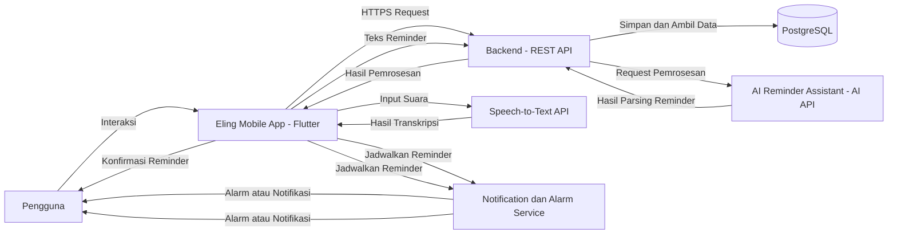

## 2.2 Arsitektur Sistem
 
Arsitektur Eling dibagi menjadi beberapa lapisan berdasarkan tanggung jawab masing-masing komponen. Pembagian tersebut bertujuan agar sistem lebih mudah dikembangkan, dipelihara, dan diuji.
 
### 2.2.1 Lapisan Presentasi
 
Lapisan presentasi berada pada aplikasi mobile Flutter dan bertanggung jawab terhadap interaksi langsung dengan pengguna. Fungsi utama lapisan ini meliputi:
 
- menampilkan halaman aplikasi;
- menerima input pengguna;
- menampilkan daftar reminder;
- menampilkan detail reminder;
- menampilkan hasil Speech-to-Text;
- menampilkan preview hasil AI;
- menerima konfirmasi pengguna;
- menampilkan notifikasi dan status reminder;
- menyediakan navigasi antarhalaman.
Lapisan ini tidak bertanggung jawab langsung terhadap penyimpanan permanen data. Data yang membutuhkan penyimpanan akan diteruskan melalui mekanisme komunikasi dengan backend/API.
 
### 2.2.2 Lapisan Aplikasi
 
Lapisan aplikasi menangani logika utama yang berkaitan dengan proses reminder. Fungsi lapisan aplikasi meliputi:
 
- validasi data reminder;
- pembuatan reminder;
- perubahan reminder;
- penghapusan reminder;
- pengaturan reminder berulang;
- pengelolaan status reminder;
- pengelolaan kategori;
- pengelolaan riwayat;
- pencarian reminder;
- pengelolaan proses konfirmasi hasil AI.
Lapisan ini memastikan bahwa data yang akan disimpan telah memenuhi aturan yang ditentukan oleh sistem.
 
### 2.2.3 Lapisan Backend/API
 
Lapisan backend/API berfungsi sebagai penghubung antara aplikasi mobile dengan layanan backend dan layanan eksternal. Pada Eling, backend menggunakan **Supabase** untuk menyediakan layanan:
 
- autentikasi pengguna;
- akses data melalui API;
- pengelolaan basis data;
- pengelolaan akses terhadap data pengguna.
Backend juga menjadi bagian dari jalur komunikasi pemrosesan AI. Input reminder yang telah diberikan oleh pengguna dapat diteruskan ke layanan Google Gemini API melalui backend/API. Dengan pendekatan tersebut, kredensial layanan AI tidak ditempatkan secara langsung pada aplikasi mobile.
 
### 2.2.4 Lapisan Data
 
Lapisan data menggunakan **PostgreSQL melalui Supabase**.Lapisan ini digunakan untuk menyimpan data secara permanen, antara lain:
 
- data pengguna;
- data reminder;
- data kategori;
- data riwayat reminder;
- data pengaturan pengguna;
- data lain yang diperlukan untuk mendukung fungsi aplikasi.
Data reminder dikaitkan dengan pengguna sehingga sistem dapat membatasi akses berdasarkan akun yang sedang digunakan.
 
### 2.2.5 Lapisan Layanan Eksternal
 
Lapisan layanan eksternal terdiri dari layanan yang tidak dijalankan secara langsung oleh aplikasi Eling. Layanan tersebut meliputi:
 
1. **Google Gemini API**, digunakan untuk membantu memahami input reminder dalam bahasa natural.
2. **Speech-to-Text Service**, digunakan untuk mengubah suara pengguna menjadi teks.
Penggunaan layanan eksternal dilakukan hanya ketika fitur yang bersangkutan digunakan oleh pengguna.
 
### 2.2.6 Lapisan Perangkat
 
Beberapa fungsi Eling memanfaatkan kemampuan perangkat mobile, yaitu:
 
- mikrofon untuk input suara;
- layar sentuh untuk interaksi;
- sistem notifikasi perangkat;
- speaker untuk suara notifikasi atau alarm;
- penyimpanan dan konfigurasi perangkat yang diperlukan oleh mekanisme notifikasi.
Local notification dijalankan pada perangkat pengguna berdasarkan reminder yang telah dikonfirmasi dan dijadwalkan.
 
## 2.3 Komponen Sistem
 
Komponen sistem Eling disusun berdasarkan teknologi yang telah ditetapkan pada rancangan project dan kebutuhan yang didefinisikan pada SKPL.
 
### 2.3.1 Komponen Utama
 
| Komponen | Teknologi | Tanggung Jawab |
| --- | --- | --- |
| Aplikasi Mobile Eling | Flutter, Dart | Menampilkan antarmuka, menerima input pengguna, memvalidasi data reminder, mengelola proses konfirmasi hasil AI, serta menjadwalkan alarm dan notifikasi pada perangkat. |
| Backend/API | Supabase, REST API | Menyediakan akses data melalui API, mengelola hak akses data berdasarkan akun pengguna, dan meneruskan input reminder ke layanan AI. |
| Autentikasi | Supabase Auth | Menangani registrasi, login, logout, dan autentikasi pengguna. |
| Basis Data | PostgreSQL (melalui Supabase) | Menyimpan data pengguna, reminder, kategori, riwayat reminder, dan pengaturan pengguna. |
| AI Reminder Assistant | Google Gemini API | Membantu mengenali aktivitas, tanggal, waktu, dan pengulangan dari teks input bahasa natural. |
| Speech-to-Text | Speech-to-Text API/Service, terintegrasi pada Flutter | Mengubah suara pengguna menjadi teks. |
| Local Notification dan Alarm | Local Notification, terintegrasi pada Flutter | Memberikan alarm atau notifikasi pada waktu reminder, termasuk ketika aplikasi tidak sedang dibuka. |
| Perangkat Android | Mikrofon, speaker, layar sentuh, sistem notifikasi | Menyediakan perangkat keras yang dibutuhkan untuk input suara, suara alarm, interaksi, dan penampilan notifikasi. |
 
### 2.3.2 Komponen Internal Aplikasi
 
Fungsi aplikasi dibagi ke dalam modul-modul berikut. Perancangan setiap modul dijelaskan pada Bab 3.
 
| Modul | Fungsi Utama | Fitur Terkait |
| --- | --- | --- |
| Modul Autentikasi | Registrasi, login, logout, dan pengelolaan profil pengguna. | Autentikasi dan manajemen pengguna |
| Modul Manajemen Reminder | Membuat, melihat, mengubah, menghapus reminder, serta mengatur pengulangan. | Manajemen reminder, reminder berulang |
| Modul Alarm dan Notifikasi | Menjadwalkan notifikasi, melakukan snooze, dan menandai reminder selesai. | Alarm dan notifikasi |
| Modul Speech-to-Text | Menerima input suara dan menampilkan hasil transkripsi. | Speech-to-Text |
| Modul AI Reminder Assistant | Mengirim teks input, menerima hasil pemrosesan AI, menampilkan preview, dan meminta konfirmasi. | AI Reminder Assistant, AI Reminder Preview |
| Modul Kategori | Mengelompokkan reminder berdasarkan kategori. | Kategori reminder |
| Modul Riwayat Reminder | Menampilkan reminder yang selesai atau terlewat. | Riwayat reminder |
| Modul Pencarian | Mencari reminder berdasarkan kata kunci dan kategori. | Pencarian reminder |
| Modul Pengaturan | Mengatur status notifikasi, suara, getaran, dan durasi snooze. | Pengaturan reminder dan notifikasi |
 
### 2.3.3 Hubungan Antarkomponen
 
- Aplikasi mobile berkomunikasi dengan backend/API melalui HTTPS.
- Aplikasi mobile berkomunikasi dengan layanan Speech-to-Text untuk mengubah suara menjadi teks.
- Backend/API berkomunikasi dengan Google Gemini API untuk memproses teks input reminder, sehingga kredensial layanan AI tidak disimpan pada aplikasi mobile.
- Backend/API menyimpan dan mengambil data pada PostgreSQL.
- Aplikasi mobile menjadwalkan alarm dan notifikasi melalui mekanisme local notification pada perangkat.
## 2.4 Alur Data Sistem
 
Bagian ini menjelaskan alur data pada fungsi-fungsi utama Eling. Penjelasan langkah proses yang lebih rinci dibahas pada Bab 6.
 
### 2.4.1 Alur Autentikasi
 
1. Pengguna memasukkan data registrasi atau login pada aplikasi mobile.
2. Aplikasi mengirim data tersebut ke layanan autentikasi pada backend.
3. Backend memverifikasi data dan mengembalikan hasil autentikasi.
4. Apabila berhasil, pengguna dapat mengakses data reminder miliknya sendiri. Apabila gagal, aplikasi menampilkan pesan kesalahan.
### 2.4.2 Alur Pembuatan Reminder Manual
 
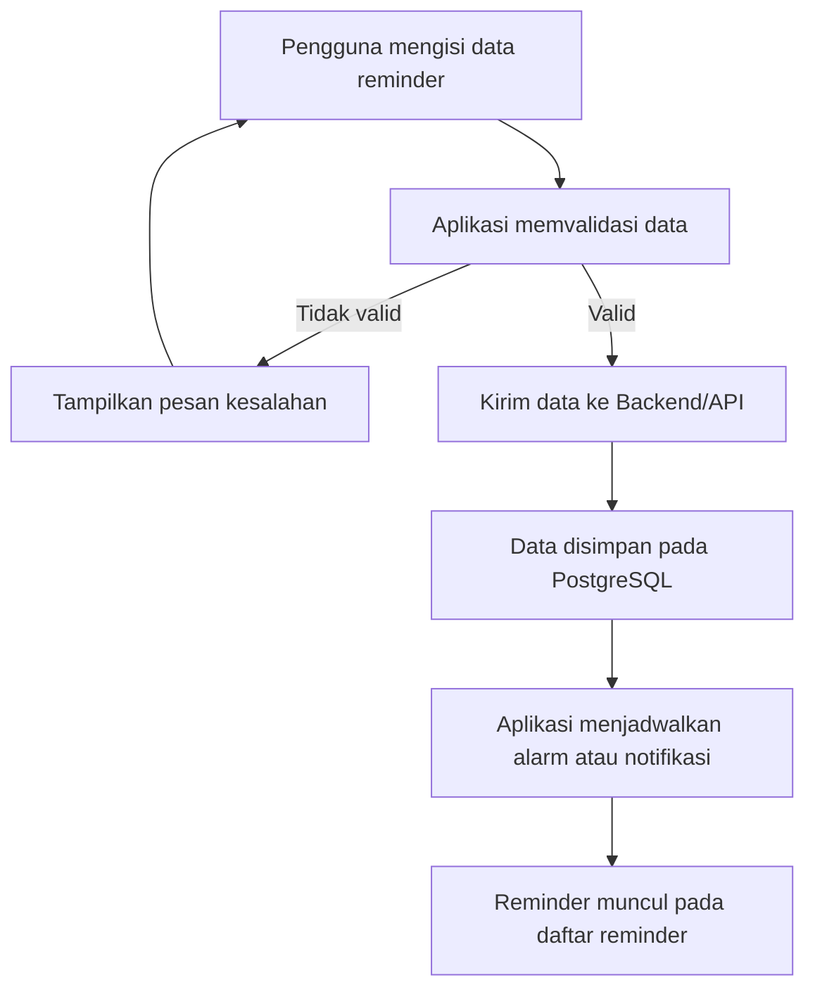
 
### 2.4.3 Alur Pembuatan Reminder dengan Suara dan AI
 
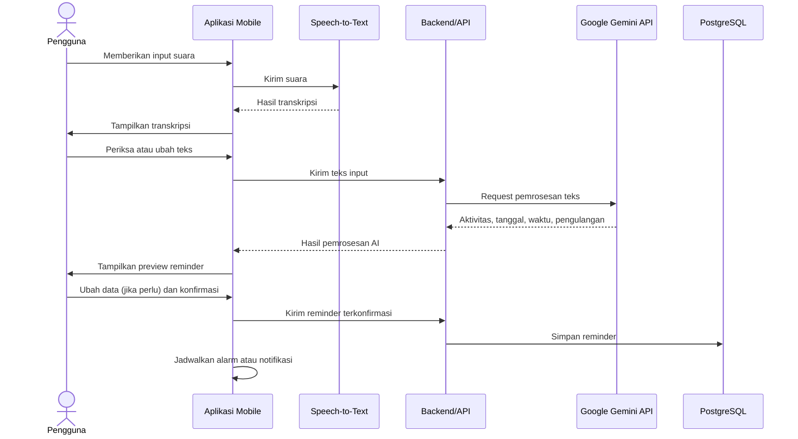
 
Ketentuan pada alur ini:
 
- hasil pemrosesan AI hanya ditampilkan sebagai preview dan belum menjadi reminder aktif;
- reminder baru disimpan setelah pengguna memberikan konfirmasi;
- teks hasil Speech-to-Text dapat diubah pengguna sebelum dikirim ke AI;
- data yang dikirim ke layanan AI dibatasi pada teks input yang diperlukan untuk pemrosesan reminder;
- apabila Speech-to-Text atau layanan AI gagal, aplikasi menampilkan pesan kesalahan dan pengguna tetap dapat membuat reminder secara manual.
### 2.4.4 Alur Alarm dan Notifikasi
 
1. Setelah reminder disimpan, aplikasi menjadwalkan alarm atau notifikasi lokal sesuai tanggal, waktu, dan pengulangan reminder.
2. Ketika waktu reminder tiba, perangkat menampilkan notifikasi yang memuat aktivitas reminder, sesuai pengaturan suara dan getaran pengguna.
3. Pengguna dapat memilih salah satu tindakan:
   - **Snooze**: alarm dijadwalkan kembali sesuai durasi snooze;
   - **Selesai**: status reminder diperbarui menjadi selesai dan dicatat pada riwayat.
4. Reminder yang tidak diselesaikan dicatat dengan status terlewat pada riwayat.
Penjadwalan notifikasi dijalankan pada perangkat sehingga reminder tetap dapat memberikan notifikasi tanpa aplikasi dibuka secara terus-menerus, selama izin notifikasi diberikan pengguna.
 
### 2.4.5 Alur Data Pengelolaan Reminder
 
| Proses | Data Masuk | Data Keluar |
| --- | --- | --- |
| Melihat daftar dan detail reminder | Permintaan pengguna | Data reminder milik pengguna yang sedang login |
| Mengubah reminder | Data reminder yang diperbarui | Data reminder tersimpan dan jadwal notifikasi diperbarui |
| Menghapus reminder | Permintaan hapus | Reminder terhapus dan jadwal notifikasi dibatalkan |
| Mencari reminder | Kata kunci atau kategori | Daftar reminder yang sesuai |
| Melihat riwayat | Permintaan pengguna | Daftar reminder berstatus selesai atau terlewat |
| Mengubah pengaturan | Status notifikasi, suara, getaran, durasi snooze | Pengaturan tersimpan dan digunakan pada penjadwalan berikutnya |
 
Seluruh akses data pada proses di atas dibatasi berdasarkan akun pengguna yang sedang login.
 
---

# 3. Perancangan Modul Sistem

Bab ini menjelaskan rancangan modul perangkat lunak yang digunakan pada aplikasi Eling. Setiap modul dirancang berdasarkan kebutuhan fungsional yang telah didefinisikan pada dokumen SKPL. Pembagian modul dilakukan berdasarkan fungsi utama sistem agar proses implementasi, pengujian, dan pemeliharaan aplikasi dapat dilakukan secara terstruktur.

Modul yang terdapat pada aplikasi Eling meliputi:

1. Modul Autentikasi
2. Modul Manajemen Reminder
3. Modul Alarm dan Notifikasi
4. Modul Speech-to-Text
5. Modul AI Reminder Assistant
6. Modul Kategori
7. Modul Riwayat Reminder
8. Modul Pencarian
9. Modul Pengaturan

---

## 3.1 Modul Autentikasi

Modul Autentikasi digunakan untuk mengelola identitas pengguna dan akses pengguna terhadap aplikasi Eling. Modul ini menggunakan **Supabase Auth** sebagai layanan autentikasi.

Modul autentikasi digunakan pada proses registrasi, login, logout, serta validasi sesi pengguna. Setiap pengguna yang berhasil melakukan autentikasi hanya dapat mengakses data yang berkaitan dengan akun miliknya.

### 3.1.1 Fungsi Modul

Fungsi utama Modul Autentikasi adalah:

* melakukan registrasi akun baru;
* melakukan login pengguna;
* melakukan logout pengguna;
* memvalidasi sesi pengguna;
* mengidentifikasi pengguna yang sedang login;
* membatasi akses data berdasarkan akun pengguna.

### 3.1.2 Input

Data yang digunakan dalam proses autentikasi meliputi:

| Data     | Keterangan                          |
| -------- | ----------------------------------- |
| Nama     | Nama pengguna pada saat registrasi  |
| Email    | Alamat email pengguna               |
| Password | Kata sandi pengguna                 |
| Session  | Informasi sesi autentikasi pengguna |

### 3.1.3 Proses

Pada proses registrasi, pengguna memasukkan nama, email, dan password. Sistem melakukan validasi terhadap data yang dimasukkan sebelum meneruskannya ke Supabase Auth.

Pada proses login, pengguna memasukkan email dan password. Supabase Auth melakukan validasi kredensial. Apabila kredensial benar, sistem membuat sesi pengguna dan memberikan akses ke aplikasi.

Pada proses logout, sesi pengguna diakhiri sehingga pengguna harus melakukan login kembali untuk mengakses data yang membutuhkan autentikasi.

### 3.1.4 Output

Output Modul Autentikasi meliputi:

* akun pengguna berhasil dibuat;
* pengguna berhasil login;
* sesi pengguna aktif;
* pengguna berhasil logout;
* pesan kesalahan apabila proses autentikasi gagal.

### 3.1.5 Alur Modul

```text
Pengguna
    |
    v
Masukkan Email dan Password
    |
    v
Validasi Input
    |
    v
Supabase Auth
    |
    +---- Tidak Valid ----> Pesan Kesalahan
    |
    v
Sesi Pengguna Aktif
    |
    v
Masuk ke Aplikasi
```

---

## 3.2 Modul Manajemen Reminder

Modul Manajemen Reminder merupakan modul utama dalam aplikasi Eling. Modul ini digunakan untuk membuat, melihat, mengubah, dan menghapus reminder.

Pengguna dapat menentukan aktivitas, tanggal, waktu, kategori, serta pengulangan reminder. Reminder yang telah berhasil disimpan akan digunakan oleh sistem untuk menjadwalkan notifikasi.

### 3.2.1 Fungsi Modul

Fungsi utama Modul Manajemen Reminder adalah:

* membuat reminder;
* melihat daftar reminder;
* melihat detail reminder;
* mengubah reminder;
* menghapus reminder;
* menentukan tanggal reminder;
* menentukan waktu reminder;
* menentukan kategori reminder;
* mengatur reminder berulang;
* mengubah status reminder.

### 3.2.2 Input

Data reminder yang digunakan meliputi:

| Data            | Keterangan                      |
| --------------- | ------------------------------- |
| Judul/Aktivitas | Aktivitas yang ingin diingatkan |
| Tanggal         | Tanggal pelaksanaan reminder    |
| Waktu           | Waktu pelaksanaan reminder      |
| Kategori        | Kategori aktivitas              |
| Pengulangan     | Pengaturan reminder berulang    |
| Status          | Status reminder                 |

### 3.2.3 Proses

Pengguna mengisi data reminder melalui halaman tambah reminder. Sistem melakukan validasi terhadap data tersebut.

Apabila data valid, aplikasi mengirimkan data ke backend/API untuk disimpan pada PostgreSQL melalui Supabase.

Setelah data berhasil disimpan, sistem menggunakan informasi tanggal dan waktu untuk menjadwalkan local notification pada perangkat pengguna.

### 3.2.4 Output

Output Modul Manajemen Reminder meliputi:

* reminder berhasil dibuat;
* daftar reminder pengguna;
* detail reminder;
* reminder berhasil diperbarui;
* reminder berhasil dihapus;
* pesan kesalahan apabila proses gagal.

### 3.2.5 Alur Modul

```text
Pengguna
    |
    v
Tambah / Pilih Reminder
    |
    v
Input Data Reminder
    |
    v
Validasi Data
    |
    +---- Tidak Valid ----> Tampilkan Pesan Kesalahan
    |
    v
Backend / API
    |
    v
PostgreSQL
    |
    v
Reminder Tersimpan
    |
    v
Jadwalkan Notifikasi
```

### 3.2.6 Reminder Berulang

Pengguna dapat mengatur reminder agar dilakukan secara berulang.

Pilihan pengulangan yang disediakan meliputi:

* sekali;
* setiap hari;
* hari kerja;
* mingguan;
* pengulangan tertentu.

Informasi pengulangan disimpan bersama data reminder dan digunakan untuk menentukan jadwal notifikasi berikutnya.

---

## 3.3 Modul Alarm dan Notifikasi

Modul Alarm dan Notifikasi bertanggung jawab untuk memberikan pengingat kepada pengguna ketika waktu reminder telah tiba.

Eling menggunakan **local notification** pada perangkat mobile. Dengan mekanisme ini, notifikasi dapat diberikan tanpa pengguna harus membuka aplikasi secara terus-menerus.

### 3.3.1 Fungsi Modul

Fungsi utama modul meliputi:

* menjadwalkan notifikasi;
* menampilkan notifikasi reminder;
* menampilkan aktivitas reminder;
* menjalankan snooze;
* menjadwalkan ulang reminder setelah snooze;
* mendukung penyelesaian reminder.

### 3.3.2 Input

Input Modul Alarm dan Notifikasi meliputi:

| Data              | Keterangan                                 |
| ----------------- | ------------------------------------------ |
| Judul Reminder    | Aktivitas yang ditampilkan pada notifikasi |
| Tanggal           | Tanggal notifikasi                         |
| Waktu             | Waktu notifikasi                           |
| Pengulangan       | Jadwal pengulangan                         |
| Status Notifikasi | Status aktif/nonaktif                      |
| Durasi Snooze     | Durasi penundaan reminder                  |

### 3.3.3 Proses

Setelah reminder berhasil disimpan, sistem membuat jadwal local notification berdasarkan tanggal dan waktu reminder.

Ketika waktu reminder tiba, sistem menampilkan notifikasi kepada pengguna. Pengguna dapat menandai reminder sebagai selesai atau memilih snooze.

### 3.3.4 Output

Output modul meliputi:

* notifikasi reminder;
* alarm;
* perubahan jadwal setelah snooze;
* perubahan status reminder.

### 3.3.5 Alur Modul

```text
Reminder Tersimpan
       |
       v
Data Tanggal dan Waktu
       |
       v
Local Notification Scheduler
       |
       v
Waktu Reminder Tiba
       |
       v
Notifikasi Ditampilkan
       |
       +------------------+
       |                  |
       v                  v
    Selesai             Snooze
       |                  |
       v                  v
Status Selesai      Jadwalkan Ulang
```

### 3.3.6 Snooze

Snooze digunakan untuk menunda reminder ketika pengguna belum dapat menyelesaikan aktivitas.

Pengguna dapat memilih durasi snooze yang tersedia. Setelah durasi snooze berakhir, sistem menjadwalkan kembali notifikasi reminder.

---

## 3.4 Modul Speech-to-Text

Modul Speech-to-Text digunakan untuk memungkinkan pengguna membuat reminder menggunakan input suara.

Suara pengguna dikonversi menjadi teks menggunakan layanan Speech-to-Text. Hasil transkripsi kemudian ditampilkan kepada pengguna agar dapat diperiksa dan diperbaiki sebelum digunakan dalam proses berikutnya.

### 3.4.1 Fungsi Modul

Fungsi Modul Speech-to-Text adalah:

* menerima input suara pengguna;
* menggunakan mikrofon perangkat;
* mengirim input suara ke layanan Speech-to-Text;
* menerima hasil transkripsi;
* menampilkan hasil transkripsi;
* memungkinkan pengguna mengubah hasil transkripsi.

### 3.4.2 Input

Input modul berupa suara pengguna melalui mikrofon perangkat.

Contoh input:

> "Besok jam 8 pagi ingatkan saya untuk mengerjakan laporan."

### 3.4.3 Proses

Pengguna menekan tombol input suara dan memberikan izin penggunaan mikrofon apabila diperlukan.

Suara kemudian diproses oleh layanan Speech-to-Text dan diubah menjadi teks.

Hasil transkripsi dikembalikan ke aplikasi dan ditampilkan kepada pengguna.

### 3.4.4 Output

Output modul berupa teks hasil transkripsi.

Contoh:

```text
Besok jam 8 pagi ingatkan saya untuk mengerjakan laporan.
```

Pengguna dapat mengubah hasil transkripsi sebelum teks dikirimkan untuk proses AI.

### 3.4.5 Alur Modul

```text
Pengguna
    |
    v
Input Suara
    |
    v
Mikrofon
    |
    v
Speech-to-Text Service
    |
    v
Hasil Transkripsi
    |
    v
Tampilkan Teks
    |
    v
Pengguna Memeriksa / Mengubah
    |
    v
Teks Siap Diproses
```

Apabila proses Speech-to-Text gagal, sistem menampilkan pesan kesalahan. Pengguna tetap dapat menggunakan input manual untuk membuat reminder.

---

## 3.5 Modul AI Reminder Assistant

Modul AI Reminder Assistant digunakan untuk membantu pengguna membuat reminder menggunakan bahasa natural.

Modul ini menggunakan **Google Gemini API** untuk membantu memahami informasi yang terdapat pada input pengguna.

AI digunakan sebagai fitur pendukung. Sistem tidak langsung menyimpan hasil pemrosesan AI sebagai reminder aktif. Hasil AI harus ditampilkan kepada pengguna dalam bentuk preview dan pengguna harus memberikan konfirmasi sebelum reminder disimpan.

### 3.5.1 Fungsi Modul

Fungsi utama Modul AI Reminder Assistant meliputi:

* menerima teks input pengguna;
* mengirim teks ke layanan AI;
* mengenali aktivitas reminder;
* mengenali tanggal reminder;
* mengenali waktu reminder;
* mengenali informasi pengulangan;
* menghasilkan data reminder;
* menampilkan hasil dalam bentuk preview.

### 3.5.2 Input

Input dapat berasal dari:

1. teks yang diketik pengguna;
2. hasil Speech-to-Text.

Contoh input:

> "Besok jam 7 pagi ingatkan saya untuk mengerjakan tugas pemrograman."

### 3.5.3 Proses

Teks pengguna dikirim dari aplikasi menuju backend/API.

Backend kemudian meneruskan permintaan ke Google Gemini API. AI membantu mengidentifikasi informasi reminder dari teks tersebut.

Contoh hasil pemrosesan:

| Informasi   | Hasil                         |
| ----------- | ----------------------------- |
| Aktivitas   | Mengerjakan tugas pemrograman |
| Tanggal     | Besok                         |
| Waktu       | 07.00                         |
| Pengulangan | Tidak ada                     |

Hasil pemrosesan kemudian dikembalikan melalui backend/API menuju aplikasi mobile.

### 3.5.4 Output

Output modul berupa data hasil pemrosesan AI yang terdiri dari:

* aktivitas;
* tanggal;
* waktu;
* pengulangan apabila tersedia.

Data tersebut ditampilkan dalam bentuk preview kepada pengguna.

### 3.5.5 Alur Modul

```text
Teks Pengguna
      |
      v
Mobile Application
      |
      v
Backend / API
      |
      v
Google Gemini API
      |
      v
Hasil Pemrosesan AI
      |
      v
Backend / API
      |
      v
Mobile Application
      |
      v
Preview Reminder
```

### 3.5.6 Konfirmasi Hasil AI

Hasil pemrosesan AI tidak langsung disimpan sebagai reminder aktif.

Pengguna harus memeriksa hasil yang diberikan oleh AI. Jika terdapat informasi yang tidak sesuai, pengguna dapat melakukan perubahan.

Apabila informasi sudah benar, pengguna memberikan konfirmasi untuk menyimpan reminder.

```text
Preview AI
    |
    v
Periksa Data
    |
    v
Data Sudah Benar?
    |
    +---- Tidak ----> Edit Data
    |                    |
    |                    v
    |               Preview Kembali
    |
    +---- Ya -------> Konfirmasi
                         |
                         v
                  Simpan Reminder
```

### 3.5.7 Penanganan Kegagalan AI

Apabila layanan Google Gemini API tidak tersedia atau gagal memproses input, sistem menampilkan pesan kesalahan kepada pengguna.

Kegagalan layanan AI tidak mengganggu fungsi utama aplikasi. Pengguna tetap dapat membuat reminder secara manual.

```text
Input Pengguna
      |
      v
Pemrosesan AI
      |
      v
   Berhasil?
    /     \
  Tidak    Ya
   |        |
   v        v
Pesan     Preview
Error       AI
   |
   v
Reminder Manual
```

---

## 3.6 Modul Kategori

Modul Kategori digunakan untuk mengelompokkan reminder berdasarkan jenis aktivitas.

Kategori membantu pengguna mengorganisasi reminder dan mempermudah pengguna ketika melihat atau mencari reminder.

### 3.6.1 Fungsi Modul

Fungsi Modul Kategori meliputi:

* memberikan kategori pada reminder;
* menyimpan kategori reminder;
* menampilkan kategori reminder;
* mengelompokkan reminder berdasarkan kategori.

### 3.6.2 Daftar Kategori

Kategori yang tersedia pada sistem adalah:

| Kategori  | Contoh Aktivitas         |
| --------- | ------------------------ |
| Kuliah    | Jadwal kuliah            |
| Tugas     | Mengerjakan tugas        |
| Pribadi   | Aktivitas pribadi        |
| Kesehatan | Minum obat atau olahraga |
| Pekerjaan | Rapat atau pekerjaan     |
| Lainnya   | Aktivitas lain           |

### 3.6.3 Proses

Ketika pengguna membuat atau mengubah reminder, pengguna dapat memilih kategori yang sesuai.

Kategori kemudian disimpan bersama data reminder.

### 3.6.4 Alur Modul

```text
Reminder
    |
    v
Pilih Kategori
    |
    +---- Kuliah
    +---- Tugas
    +---- Pribadi
    +---- Kesehatan
    +---- Pekerjaan
    +---- Lainnya
    |
    v
Simpan Reminder
```

---

## 3.7 Modul Riwayat Reminder

Modul Riwayat Reminder digunakan untuk mencatat dan menampilkan reminder yang telah selesai atau terlewat.

Modul ini memberikan informasi kepada pengguna mengenai aktivitas reminder yang telah terjadi.

### 3.7.1 Fungsi Modul

Fungsi Modul Riwayat Reminder meliputi:

* mencatat reminder yang selesai;
* mencatat reminder yang terlewat;
* menampilkan daftar riwayat;
* menampilkan status reminder;
* menyimpan waktu pencatatan riwayat.

### 3.7.2 Data Riwayat

Data yang digunakan dalam riwayat meliputi:

| Data             | Keterangan                  |
| ---------------- | --------------------------- |
| ID Riwayat       | Identitas data riwayat      |
| ID Reminder      | Referensi reminder          |
| Status           | Status reminder             |
| Waktu Selesai    | Waktu reminder diselesaikan |
| Waktu Terlewat   | Waktu reminder terlewat     |
| Waktu Pencatatan | Waktu data riwayat dibuat   |

### 3.7.3 Proses

Ketika reminder selesai atau terlewat, sistem memperbarui status reminder dan mencatat informasi tersebut ke dalam riwayat.

```text
Reminder
    |
    v
Waktu Reminder Tiba
    |
    v
Status Reminder
    |
    +---- Selesai ----> Simpan ke Riwayat
    |
    +---- Terlewat ---> Simpan ke Riwayat
```

### 3.7.4 Output

Output modul berupa daftar riwayat reminder yang dapat dilihat oleh pengguna.

Riwayat menampilkan informasi mengenai reminder yang telah selesai maupun reminder yang terlewat.

---

## 3.8 Modul Pencarian

Modul Pencarian digunakan untuk membantu pengguna menemukan reminder tertentu berdasarkan kata kunci.

Modul ini digunakan ketika pengguna memiliki banyak reminder sehingga pencarian secara manual menjadi kurang efektif.

### 3.8.1 Fungsi Modul

Fungsi Modul Pencarian meliputi:

* menerima kata kunci;
* mencari reminder berdasarkan kata kunci;
* menampilkan hasil pencarian;
* membantu pengguna menemukan reminder berdasarkan kategori.

### 3.8.2 Input

Input modul berupa kata kunci pencarian yang dimasukkan pengguna.

Contoh:

```text
tugas
```

### 3.8.3 Proses

Sistem menerima kata kunci dan melakukan pencocokan terhadap data reminder milik pengguna.

Alur proses:

```text
Pengguna
    |
    v
Masukkan Kata Kunci
    |
    v
Modul Pencarian
    |
    v
Data Reminder Pengguna
    |
    v
Pencocokan Kata Kunci
    |
    v
Hasil Pencarian
```

### 3.8.4 Output

Output berupa daftar reminder yang sesuai dengan kata kunci pencarian.

Apabila tidak terdapat reminder yang sesuai, sistem menampilkan informasi bahwa reminder yang dicari tidak ditemukan.

---

## 3.9 Modul Pengaturan

Modul Pengaturan digunakan untuk mengelola preferensi pengguna yang berkaitan dengan notifikasi, suara, getaran, dan snooze.

Pengaturan digunakan sebagai konfigurasi yang menentukan perilaku sistem ketika memberikan notifikasi reminder.

### 3.9.1 Fungsi Modul

Fungsi Modul Pengaturan meliputi:

* mengatur status notifikasi;
* mengatur suara notifikasi atau alarm;
* mengatur getaran;
* mengatur durasi snooze default;
* menyimpan pengaturan pengguna.

### 3.9.2 Pengaturan Notifikasi

Pengguna dapat mengatur status notifikasi aplikasi.

Pilihan yang tersedia:

* aktif;
* nonaktif.

```text
Notifikasi
    |
    +---- Aktif
    |
    +---- Nonaktif
```

Apabila notifikasi aktif dan izin notifikasi pada perangkat diberikan, sistem dapat memberikan notifikasi sesuai jadwal reminder.

### 3.9.3 Pengaturan Suara

Pengguna dapat mengatur penggunaan suara pada notifikasi atau alarm reminder.

Pengaturan ini digunakan oleh sistem ketika reminder telah mencapai waktu yang ditentukan.

### 3.9.4 Pengaturan Getaran

Pengguna dapat menentukan apakah perangkat menggunakan getaran ketika memberikan notifikasi reminder.

```text
Getaran
    |
    +---- Aktif
    |
    +---- Nonaktif
```

### 3.9.5 Pengaturan Snooze

Pengguna dapat menentukan durasi snooze default.

Durasi tersebut digunakan ketika pengguna memilih tindakan snooze pada notifikasi reminder.

### 3.9.6 Alur Modul

```text
Pengguna
    |
    v
Halaman Pengaturan
    |
    +---- Status Notifikasi
    |
    +---- Suara
    |
    +---- Getaran
    |
    +---- Durasi Snooze
    |
    v
Simpan Pengaturan
    |
    v
Konfigurasi Digunakan Sistem
```

Pengaturan yang telah disimpan akan digunakan oleh sistem pada proses notifikasi dan pengelolaan reminder berikutnya.

---

# 4. Perancangan Basis Data
 
## 4.1 Gambaran Basis Data
 
Eling menggunakan **PostgreSQL** yang disediakan melalui **Supabase** sebagai basis data utama. Basis data bersifat relasional dan digunakan untuk menyimpan data pengguna, reminder, kategori, riwayat reminder, pengaturan notifikasi, dan data pemrosesan AI sesuai kebutuhan data pada SKPL Bagian 3.5.
 
Prinsip perancangan basis data:
 
- setiap reminder, riwayat, pengaturan, dan permintaan AI dikaitkan dengan pengguna sehingga akses data dapat dibatasi berdasarkan akun yang sedang login (SKPL-F-003 dan SKPL-NF-009);
- data kredensial autentikasi dikelola oleh **Supabase Auth** dan tidak disimpan pada tabel aplikasi;
- kategori bersifat tetap (disediakan sistem) dan digunakan bersama oleh seluruh pengguna;
- hasil pemrosesan AI yang belum dikonfirmasi tidak disimpan sebagai reminder (SKPL-F-035);
- pembatasan akses pada tingkat basis data dijelaskan lebih lanjut pada Bab 10.
## 4.2 Entitas Basis Data
 
| Entitas | Tabel | Fungsi | Dasar SKPL |
| --- | --- | --- | --- |
| Pengguna | `profiles` | Menyimpan data profil pengguna yang terhubung dengan akun Supabase Auth. | 3.5.1 |
| Reminder | `reminders` | Menyimpan data reminder milik pengguna. | 3.5.2 |
| Kategori | `categories` | Menyimpan daftar kategori reminder. | 3.5.3 |
| Riwayat Reminder | `reminder_history` | Mencatat status reminder yang selesai atau terlewat. | 3.5.4 |
| Pengaturan Notifikasi | `notification_settings` | Menyimpan preferensi notifikasi pengguna. | 3.5.5 |
| Pemrosesan AI | `ai_requests` | Mencatat permintaan dan hasil pemrosesan AI. | 3.5.6 |
 
Data kredensial (email dan kata sandi untuk autentikasi) berada pada layanan Supabase Auth dan menjadi sumber identitas pengguna.
 
## 4.3 Relasi Antarentitas
 
| Relasi | Kardinalitas | Keterangan |
| --- | --- | --- |
| `profiles` – `reminders` | satu ke banyak | Satu pengguna dapat memiliki banyak reminder. |
| `categories` – `reminders` | satu ke banyak | Satu kategori dapat digunakan oleh banyak reminder. |
| `reminders` – `reminder_history` | satu ke banyak | Satu reminder dapat memiliki catatan riwayat. |
| `profiles` – `notification_settings` | satu ke satu | Setiap pengguna memiliki satu data pengaturan notifikasi. |
| `profiles` – `ai_requests` | satu ke banyak | Satu pengguna dapat memiliki banyak permintaan pemrosesan AI. |
 
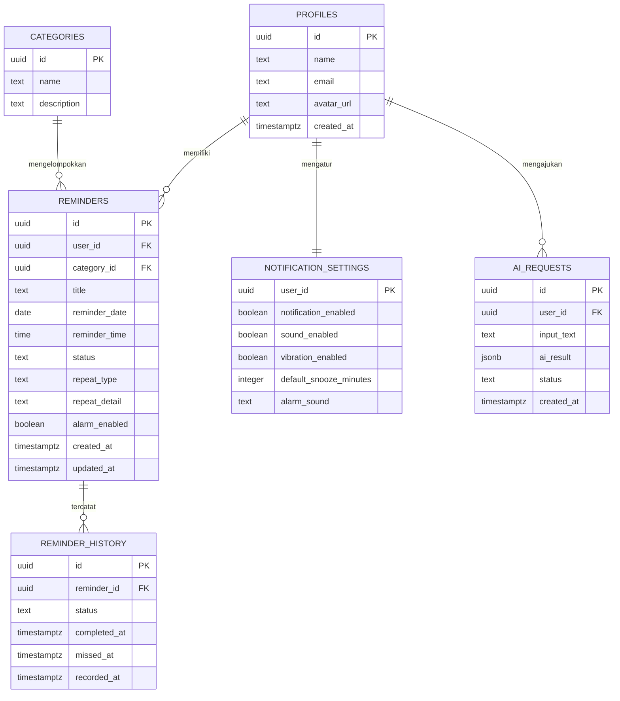
 
## 4.4 Struktur Tabel
 
Tipe data yang digunakan mengikuti PostgreSQL. Identitas pengguna (`id` pada `profiles`) merujuk pada identitas akun pada Supabase Auth.
 
### 4.4.1 Tabel `profiles`
 
| Kolom | Tipe Data | Kunci | Wajib | Keterangan |
| --- | --- | --- | --- | --- |
| `id` | uuid | PK, FK ke akun Supabase Auth | Ya | ID pengguna. |
| `name` | text | | Ya | Nama pengguna. |
| `email` | text | | Ya | Email pengguna. |
| `avatar_url` | text | | Tidak | Lokasi foto profil. |
| `created_at` | timestamptz | | Ya | Waktu pembuatan akun. |
 
### 4.4.2 Tabel `categories`
 
| Kolom | Tipe Data | Kunci | Wajib | Keterangan |
| --- | --- | --- | --- | --- |
| `id` | uuid | PK | Ya | ID kategori. |
| `name` | text | | Ya | Nama kategori. Bersifat unik. |
| `description` | text | | Tidak | Deskripsi kategori. |
 
Data awal kategori: Kuliah, Tugas, Pribadi, Kesehatan, Pekerjaan, dan Lainnya (SKPL-F-039).
 
### 4.4.3 Tabel `reminders`
 
| Kolom | Tipe Data | Kunci | Wajib | Keterangan |
| --- | --- | --- | --- | --- |
| `id` | uuid | PK | Ya | ID reminder. |
| `user_id` | uuid | FK ke `profiles.id` | Ya | Pemilik reminder. |
| `category_id` | uuid | FK ke `categories.id` | Tidak | Kategori reminder. |
| `title` | text | | Ya | Judul atau aktivitas reminder. |
| `reminder_date` | date | | Ya | Tanggal reminder. |
| `reminder_time` | time | | Ya | Waktu reminder. |
| `status` | text | | Ya | Status reminder: `aktif`, `selesai`, atau `terlewat`. |
| `repeat_type` | text | | Ya | Jenis pengulangan: `sekali`, `setiap hari`, `hari kerja`, `mingguan`, atau `tertentu`. |
| `repeat_detail` | text | | Tidak | Rincian pengulangan, digunakan pada pengulangan tertentu. |
| `alarm_enabled` | boolean | | Ya | Status alarm reminder. |
| `created_at` | timestamptz | | Ya | Waktu pembuatan. |
| `updated_at` | timestamptz | | Ya | Waktu perubahan terakhir. |
 
### 4.4.4 Tabel `reminder_history`
 
| Kolom | Tipe Data | Kunci | Wajib | Keterangan |
| --- | --- | --- | --- | --- |
| `id` | uuid | PK | Ya | ID riwayat. |
| `reminder_id` | uuid | FK ke `reminders.id` | Ya | Reminder yang dicatat. |
| `status` | text | | Ya | Status yang dicatat: `selesai` atau `terlewat`. |
| `completed_at` | timestamptz | | Tidak | Waktu reminder diselesaikan. Terisi apabila status `selesai`. |
| `missed_at` | timestamptz | | Tidak | Waktu reminder terlewat. Terisi apabila status `terlewat`. |
| `recorded_at` | timestamptz | | Ya | Waktu pencatatan riwayat. |
 
Riwayat dikaitkan dengan pengguna melalui `reminders.user_id`. Apabila sebuah reminder dihapus, catatan riwayatnya ikut dihapus.
 
### 4.4.5 Tabel `notification_settings`
 
| Kolom | Tipe Data | Kunci | Wajib | Keterangan |
| --- | --- | --- | --- | --- |
| `user_id` | uuid | PK, FK ke `profiles.id` | Ya | Pemilik pengaturan. |
| `notification_enabled` | boolean | | Ya | Status notifikasi. |
| `sound_enabled` | boolean | | Ya | Status suara. |
| `vibration_enabled` | boolean | | Ya | Status getaran. |
| `default_snooze_minutes` | integer | | Ya | Durasi snooze default dalam menit. |
| `alarm_sound` | text | | Tidak | Pilihan suara alarm. |
 
Nilai awal pengaturan ditentukan pada tahap implementasi.
 
### 4.4.6 Tabel `ai_requests`
 
| Kolom | Tipe Data | Kunci | Wajib | Keterangan |
| --- | --- | --- | --- | --- |
| `id` | uuid | PK | Ya | ID permintaan. |
| `user_id` | uuid | FK ke `profiles.id` | Ya | Pengguna yang mengajukan permintaan. |
| `input_text` | text | | Ya | Teks input pengguna. |
| `ai_result` | jsonb | | Tidak | Hasil pemrosesan AI sesuai format pada Bagian 7.4. |
| `status` | text | | Ya | Status pemrosesan: `berhasil` atau `gagal`. |
| `created_at` | timestamptz | | Ya | Waktu permintaan. |
 
Tabel ini hanya mencatat permintaan dan hasil AI. Data pada tabel ini bukan reminder aktif. Reminder hanya dibuat pada tabel `reminders` setelah pengguna memberikan konfirmasi.
 
### 4.4.7 Pemetaan Kebutuhan Data
 
| Kebutuhan SKPL | Tabel |
| --- | --- |
| SKPL-F-001, SKPL-F-004, SKPL-F-005, SKPL-F-048 | `profiles` |
| SKPL-F-006 s.d. SKPL-F-015, SKPL-F-020 | `reminders` |
| SKPL-F-038, SKPL-F-039, SKPL-F-043 | `categories`, `reminders` |
| SKPL-F-021, SKPL-F-040, SKPL-F-041 | `reminder_history`, `reminders` |
| SKPL-F-019, SKPL-F-044 s.d. SKPL-F-047 | `notification_settings` |
| SKPL-F-028 s.d. SKPL-F-037 | `ai_requests`, `reminders` |
 
---
# 5. Perancangan Antarmuka
 
## 5.1 Prinsip Perancangan Antarmuka
 
Perancangan antarmuka Eling dilakukan menggunakan Figma, mulai dari wireframe, prototype, style guide, hingga komponen antarmuka. Perancangan mengikuti kebutuhan antarmuka pada SKPL (Bagian 3.1.1) dan kebutuhan nonfungsional kegunaan serta konsistensi (SKPL-NF-001, SKPL-NF-002, SKPL-NF-003, dan SKPL-NF-014).
 
Prinsip yang digunakan:
 
- **Sederhana**, sehingga pengguna tanpa kemampuan teknis khusus dapat menggunakan aplikasi;
- **Konsisten**, dengan istilah, tombol, dan navigasi yang sama pada seluruh halaman;
- **Langkah minimal**, terutama pada pembuatan reminder;
- **Umpan balik jelas**, dengan indikator proses pada Speech-to-Text dan pemrosesan AI serta pesan kesalahan yang jelas saat terjadi kegagalan;
- **Kontrol berada pada pengguna**, karena hasil AI selalu ditampilkan sebagai preview dan baru disimpan setelah dikonfirmasi;
- **Reminder manual tetap tersedia**, apabila Speech-to-Text atau layanan AI tidak dapat digunakan.
Daftar halaman pada SKPL dan penjelasannya dalam dokumen ini:
 
| Halaman | Penjelasan |
| --- | --- |
| Login | 5.2 |
| Registrasi | 5.3 |
| Utama, Daftar Reminder, Pencarian, Kategori | 5.4 |
| Tambah Reminder dan Edit Reminder | 5.5 |
| Input Suara | 5.6 |
| Preview Hasil AI | 5.7 |
| Detail Reminder | 5.8 |
| Riwayat Reminder | 5.9 |
| Profil dan Pengaturan Notifikasi | 5.10 |
 
Halaman daftar reminder, pencarian, dan kategori dijelaskan bersama halaman utama karena ketiganya berkaitan dengan penampilan dan penyaringan daftar reminder. Halaman edit reminder menggunakan isian yang sama dengan halaman tambah reminder. Halaman profil dijelaskan bersama pengaturan.
 
Alur navigasi utama:
 
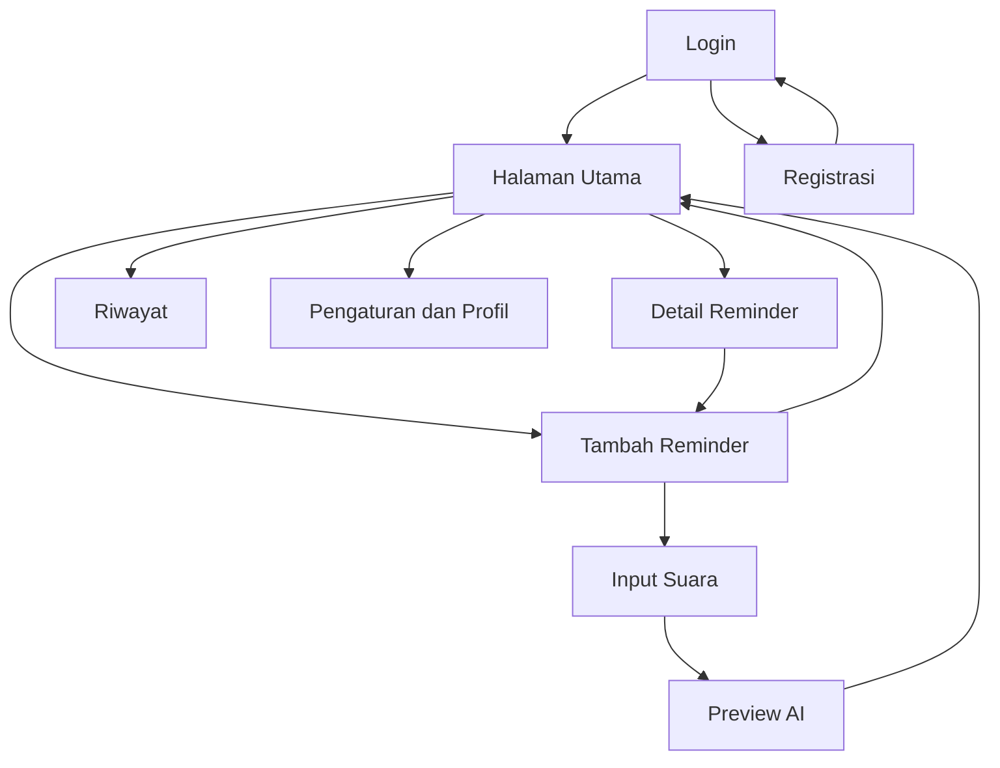
 
Pada diagram, tanda panah dari Detail Reminder ke Tambah Reminder menggambarkan proses ubah reminder yang menggunakan formulir yang sama.
 
## 5.2 Halaman Login
 
**Tujuan:** memungkinkan pengguna yang sudah memiliki akun masuk ke aplikasi (UC-01).
 
**Elemen antarmuka:**
 
- isian email;
- isian kata sandi;
- tombol Login;
- tautan menuju halaman Registrasi;
- area pesan kesalahan.
**Perilaku:**
 
- apabila data valid dan autentikasi berhasil, pengguna diarahkan ke Halaman Utama;
- apabila data kosong atau autentikasi gagal, aplikasi menampilkan pesan kesalahan yang jelas.
**Kebutuhan terkait:** SKPL-F-002, SKPL-F-003, SKPL-NF-016.
 
## 5.3 Halaman Registrasi
 
**Tujuan:** memungkinkan pengguna baru membuat akun (UC-01).
 
**Elemen antarmuka:**
 
- isian nama;
- isian email;
- isian kata sandi;
- tombol Registrasi;
- tautan kembali ke halaman Login;
- area pesan kesalahan.
**Perilaku:**
 
- aplikasi memvalidasi isian sebelum dikirim ke layanan autentikasi;
- apabila registrasi berhasil, pengguna dapat melanjutkan ke aplikasi atau halaman Login;
- apabila gagal, aplikasi menampilkan pesan kesalahan.
**Kebutuhan terkait:** SKPL-F-001, SKPL-NF-015, SKPL-NF-016.
 
## 5.4 Halaman Utama
 
**Tujuan:** menjadi pusat navigasi dan menampilkan daftar reminder milik pengguna (UC-04, UC-14, UC-16).
 
**Elemen antarmuka:**
 
- daftar reminder yang menampilkan judul, tanggal, waktu, dan kategori;
- kolom pencarian berdasarkan kata kunci;
- pilihan kategori (Kuliah, Tugas, Pribadi, Kesehatan, Pekerjaan, dan Lainnya) untuk menyaring daftar;
- tombol tambah reminder;
- akses navigasi ke Riwayat dan Pengaturan.
**Perilaku:**
 
- hanya reminder milik pengguna yang sedang login yang ditampilkan;
- memilih salah satu reminder membuka Halaman Detail Reminder;
- memasukkan kata kunci atau memilih kategori menyaring daftar sesuai pilihan;
- apabila tidak ada reminder, aplikasi menampilkan keadaan kosong.
**Kebutuhan terkait:** SKPL-F-003, SKPL-F-012, SKPL-F-042, SKPL-F-043, SKPL-F-038, SKPL-F-039.
 
## 5.5 Halaman Tambah Reminder
 
**Tujuan:** memungkinkan pengguna membuat reminder secara manual (UC-03, UC-07, UC-14). Halaman yang sama digunakan untuk mengubah reminder yang sudah ada (UC-05).
 
**Elemen antarmuka:**
 
- isian judul atau aktivitas;
- pemilih tanggal;
- pemilih waktu;
- pemilih kategori;
- pilihan pengulangan: sekali, setiap hari, hari kerja, mingguan, atau pengulangan tertentu;
- tombol input suara menuju Halaman Input Suara;
- tombol Simpan;
- tombol Batal.
**Perilaku:**
 
- aplikasi memvalidasi data (judul, tanggal, dan waktu) sebelum disimpan;
- apabila valid, reminder disimpan dan alarm atau notifikasi dijadwalkan;
- pada mode ubah, isian terisi dengan data reminder yang ada;
- apabila penyimpanan gagal, aplikasi menampilkan pesan kesalahan.
**Kebutuhan terkait:** SKPL-F-006 s.d. SKPL-F-011, SKPL-F-013, SKPL-F-014, SKPL-F-038, SKPL-NF-015.
 
## 5.6 Halaman Input Suara
 
**Tujuan:** memungkinkan pengguna membuat reminder dengan suara (UC-11).
 
**Elemen antarmuka:**
 
- tombol mikrofon untuk memulai dan menghentikan perekaman;
- indikator proses ketika suara sedang diproses;
- area teks hasil transkripsi yang dapat diubah pengguna;
- tombol Proses dengan AI untuk mengirim teks ke AI Reminder Assistant;
- tombol kembali ke pembuatan reminder manual;
- area pesan kesalahan.
**Perilaku:**
 
- aplikasi meminta izin mikrofon apabila belum diberikan;
- hasil transkripsi ditampilkan sehingga dapat diperiksa dan diperbaiki sebelum dikirim ke AI;
- apabila Speech-to-Text gagal atau memakan waktu terlalu lama, aplikasi menampilkan pesan kesalahan;
- apabila layanan AI gagal, aplikasi menampilkan pesan kesalahan dan pengguna tetap dapat membuat reminder secara manual.
**Kebutuhan terkait:** SKPL-F-023 s.d. SKPL-F-027, SKPL-F-028, SKPL-F-036, SKPL-F-037, SKPL-NF-005, SKPL-NF-006.
 
## 5.7 Halaman Preview AI
 
**Tujuan:** menampilkan hasil pemrosesan AI sebelum disimpan dan meminta konfirmasi pengguna (UC-12, UC-13).
 
**Elemen antarmuka:**
 
- teks input pengguna sebagai acuan;
- isian aktivitas atau judul hasil pengenalan AI;
- isian tanggal;
- isian waktu;
- isian pengulangan;
- pemilih kategori;
- tombol Konfirmasi dan Simpan;
- tombol Batal.
**Perilaku:**
 
- seluruh isian dapat diubah pengguna sebelum disimpan;
- apabila AI tidak mengenali sebagian informasi, isian terkait dapat dilengkapi pengguna;
- reminder tidak disimpan sebagai reminder aktif sebelum pengguna menekan tombol konfirmasi;
- setelah konfirmasi, reminder disimpan, alarm atau notifikasi dijadwalkan, dan pengguna kembali ke Halaman Utama.
**Kebutuhan terkait:** SKPL-F-029 s.d. SKPL-F-035, SKPL-F-038.
 
## 5.8 Halaman Detail Reminder
 
**Tujuan:** menampilkan informasi lengkap sebuah reminder dan menyediakan tindakan terhadapnya (UC-04, UC-05, UC-06, UC-10).
 
**Elemen antarmuka:**
 
- judul atau aktivitas;
- tanggal dan waktu;
- kategori;
- informasi pengulangan;
- status reminder;
- tombol Ubah, yang membuka formulir pada Halaman Tambah Reminder;
- tombol Hapus, dengan konfirmasi sebelum penghapusan;
- tombol Tandai Selesai.
**Perilaku:**
 
- menandai reminder selesai memperbarui statusnya dan mencatatnya pada riwayat;
- menghapus reminder membatalkan jadwal notifikasinya.
**Notifikasi pengingat:** ketika waktu reminder tiba, notifikasi pada perangkat menampilkan aktivitas reminder dengan pilihan tindakan Snooze dan Selesai (UC-08, UC-09, UC-10). Durasi snooze mengikuti pengaturan pengguna.
 
**Kebutuhan terkait:** SKPL-F-010, SKPL-F-011, SKPL-F-015, SKPL-F-016 s.d. SKPL-F-021.
 
## 5.9 Halaman Riwayat
 
**Tujuan:** menampilkan reminder yang telah selesai atau terlewat (UC-15).
 
**Elemen antarmuka:**
 
- daftar reminder berstatus selesai atau terlewat;
- keterangan status pada setiap reminder;
- tanggal dan waktu reminder.
**Perilaku:**
 
- status reminder dicatat pada riwayat ketika reminder selesai atau terlewat;
- hanya riwayat milik pengguna yang sedang login yang ditampilkan.
**Kebutuhan terkait:** SKPL-F-021, SKPL-F-040, SKPL-F-041.
 
## 5.10 Halaman Pengaturan
 
**Tujuan:** memungkinkan pengguna mengatur notifikasi dan mengelola profil (UC-02, UC-17).
 
**Elemen antarmuka:**
 
- pengaturan status notifikasi (aktif atau nonaktif);
- pengaturan suara notifikasi atau alarm;
- pengaturan getaran;
- pengaturan durasi snooze default;
- informasi profil (nama dan email) beserta tombol ubah profil;
- tombol Logout.
**Perilaku:**
 
- perubahan pengaturan disimpan dan digunakan pada penjadwalan notifikasi berikutnya;
- pengguna hanya dapat melihat dan mengubah profil miliknya sendiri.
**Kebutuhan terkait:** SKPL-F-002, SKPL-F-004, SKPL-F-005, SKPL-F-019, SKPL-F-044 s.d. SKPL-F-048.

 ---

# 6. Perancangan Proses Sistem

Bab ini menjelaskan langkah-langkah proses utama pada Eling. Alur data tingkat umum dibahas pada Bab 2.4, dan rancangan modul pada Bab 3.

## 6.1 Proses Login

**Aktor:** Pengguna  
**Acuan SKPL:** SKPL-F-002, SKPL-F-003, SKPL-NF-010

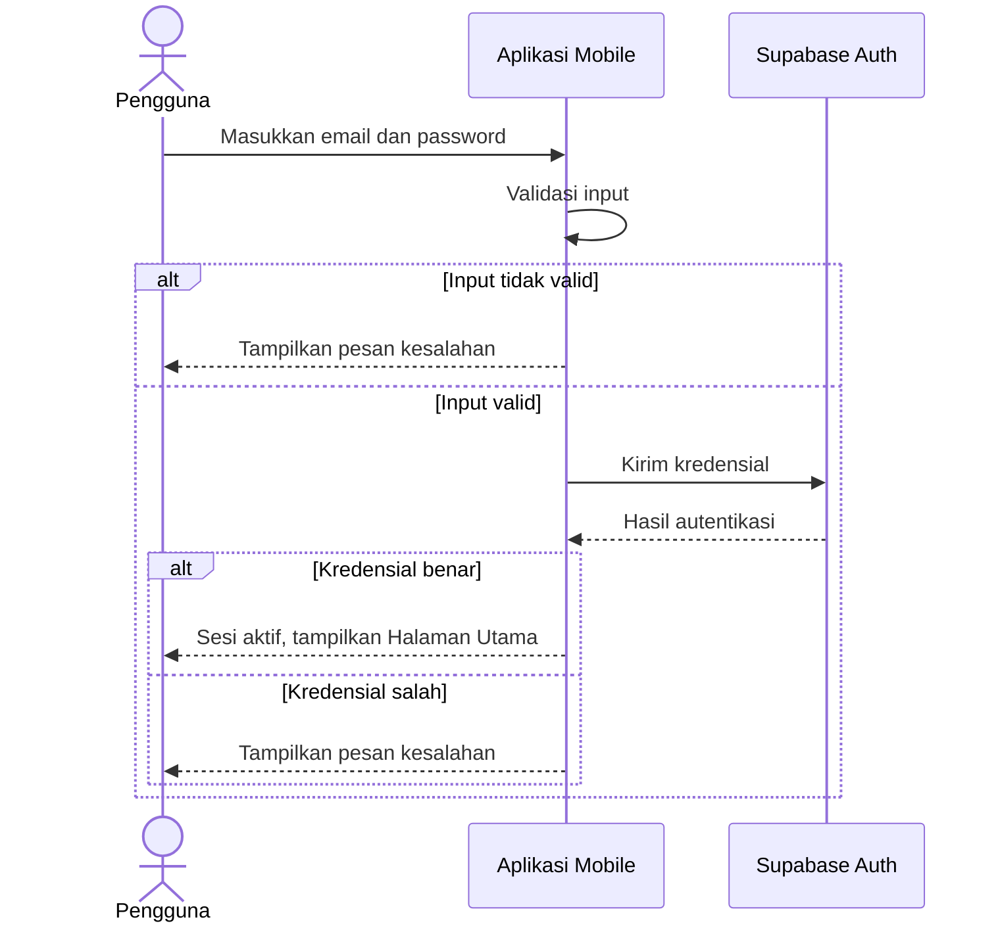

Langkah proses:

1. Pengguna memasukkan email dan password pada Halaman Login.
2. Aplikasi memvalidasi bahwa input tidak kosong dan formatnya sesuai.
3. Aplikasi mengirim kredensial ke Supabase Auth melalui HTTPS.
4. Apabila kredensial benar, sesi pengguna dibuat dan pengguna diarahkan ke Halaman Utama.
5. Apabila kredensial salah atau terjadi kegagalan koneksi, aplikasi menampilkan pesan kesalahan.

Setelah login, seluruh akses data dibatasi pada data milik pengguna tersebut. Proses registrasi mengikuti alur yang sama dengan tambahan data nama (lihat 2.4.1 dan 3.1.3), dan logout mengakhiri sesi pengguna.

## 6.2 Proses Membuat Reminder Manual

**Aktor:** Pengguna  
**Acuan SKPL:** SKPL-F-006 s.d. SKPL-F-009, SKPL-F-013, SKPL-F-014, SKPL-F-038, SKPL-NF-015

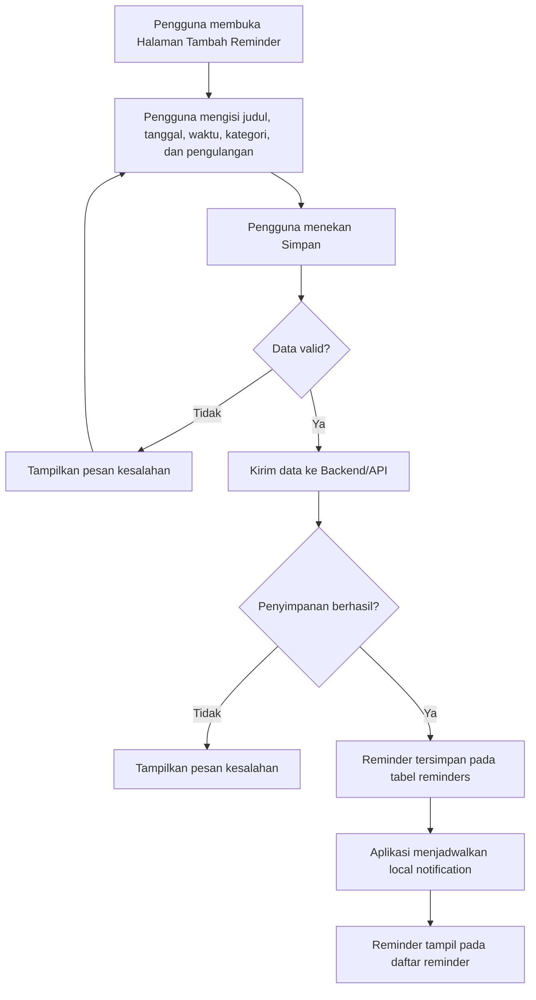

Langkah proses:

1. Pengguna mengisi data reminder pada Halaman Tambah Reminder.
2. Aplikasi memvalidasi data (judul, tanggal, dan waktu wajib diisi).
3. Apabila valid, aplikasi mengirim data ke backend/API untuk disimpan pada PostgreSQL melalui Supabase, dengan status awal `aktif`.
4. Setelah berhasil disimpan, aplikasi menjadwalkan local notification sesuai tanggal, waktu, dan pengulangan.
5. Reminder ditampilkan pada daftar reminder.

Proses mengubah reminder mengikuti langkah yang sama dan memperbarui jadwal notifikasi. Proses menghapus reminder menghapus data reminder dan membatalkan jadwal notifikasinya.

## 6.3 Proses Membuat Reminder dengan Suara

**Aktor:** Pengguna  
**Acuan SKPL:** SKPL-F-023 s.d. SKPL-F-027, SKPL-NF-005, SKPL-NF-006, SKPL-NF-016

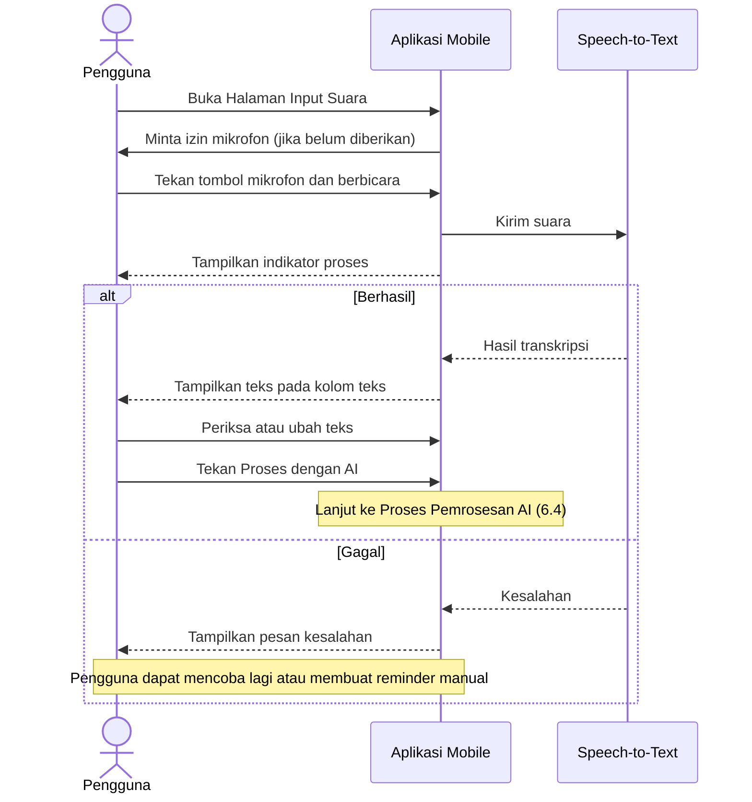

Langkah proses:

1. Pengguna membuka Halaman Input Suara dan memberikan izin mikrofon apabila diminta.
2. Pengguna menekan tombol mikrofon dan menyampaikan reminder dalam bahasa natural.
3. Aplikasi mengirim suara ke layanan Speech-to-Text dan menampilkan indikator proses.
4. Hasil transkripsi ditampilkan pada kolom teks.
5. Pengguna memeriksa dan, apabila perlu, mengubah teks.
6. Pengguna menekan **Proses dengan AI** untuk melanjutkan ke proses 6.4.

Apabila izin mikrofon ditolak, Speech-to-Text gagal, atau proses melewati batas waktu, aplikasi menampilkan pesan kesalahan. Pengguna dapat mengetik teks secara langsung pada kolom teks atau membuat reminder secara manual (proses 6.2).

## 6.4 Proses Pemrosesan AI

**Aktor:** Pengguna, Backend/API, Google Gemini API  
**Acuan SKPL:** SKPL-F-028 s.d. SKPL-F-037, SKPL-NF-005, SKPL-NF-008, SKPL-NF-011, SKPL-NF-012

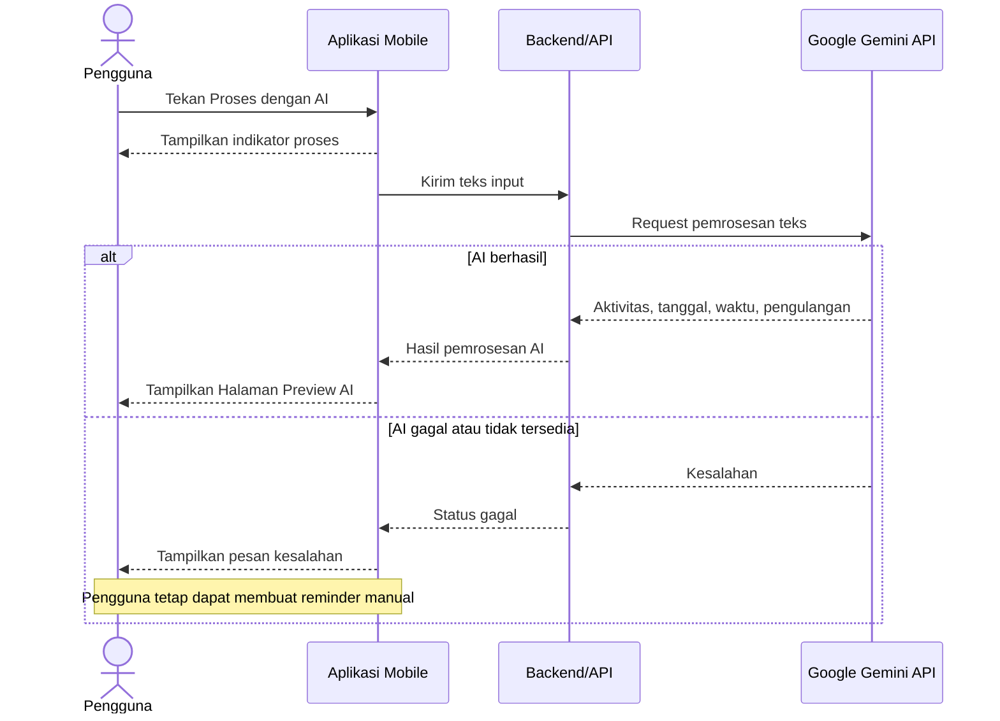

Langkah proses:

1. Aplikasi mengirim teks input pengguna ke backend/API. Data yang dikirim dibatasi pada teks yang diperlukan untuk pemrosesan reminder.
2. Backend meneruskan teks ke Google Gemini API. Kredensial layanan AI hanya berada pada sisi backend dan tidak disimpan pada aplikasi mobile.
3. AI mengidentifikasi aktivitas, tanggal, waktu, dan pengulangan dari teks.
4. Backend mengembalikan hasil ke aplikasi. Permintaan dan hasil pemrosesan dapat dicatat pada tabel `ai_requests`.
5. Aplikasi menampilkan hasil pada Halaman Preview AI.

Hasil AI hanya berupa data sementara untuk preview dan belum disimpan sebagai reminder pada tabel `reminders`. Apabila layanan AI tidak tersedia, gagal memproses input, atau melewati batas waktu, aplikasi menampilkan pesan kesalahan dan fungsi reminder manual tetap dapat digunakan. Format data dan penanganan kesalahan AI dibahas lebih rinci pada Bab 7.

## 6.5 Proses Konfirmasi Reminder

**Aktor:** Pengguna  
**Acuan SKPL:** SKPL-F-033 s.d. SKPL-F-035, SKPL-NF-015

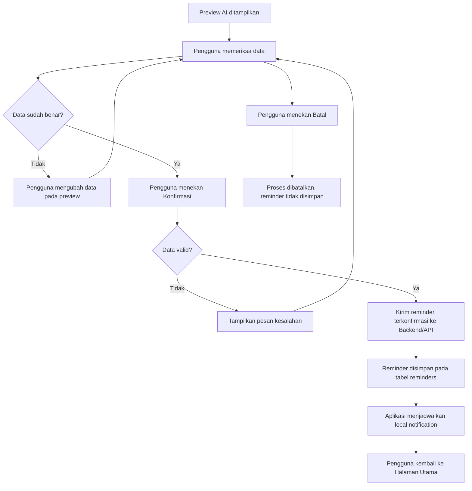

Langkah proses:

1. Pengguna memeriksa aktivitas, tanggal, waktu, pengulangan, dan kategori pada Halaman Preview AI.
2. Apabila terdapat informasi yang tidak sesuai atau kosong, pengguna mengubah atau melengkapinya.
3. Pengguna menekan **Konfirmasi**. Aplikasi memvalidasi data seperti pada proses 6.2.
4. Apabila valid, reminder disimpan pada PostgreSQL dengan status `aktif`, kemudian aplikasi menjadwalkan notifikasi.
5. Apabila pengguna menekan **Batal**, tidak ada reminder yang disimpan.

## 6.6 Proses Alarm dan Notifikasi

**Aktor:** Sistem, Pengguna  
**Acuan SKPL:** SKPL-F-016, SKPL-F-017, SKPL-F-021, SKPL-F-022, SKPL-F-044 s.d. SKPL-F-046, SKPL-NF-017

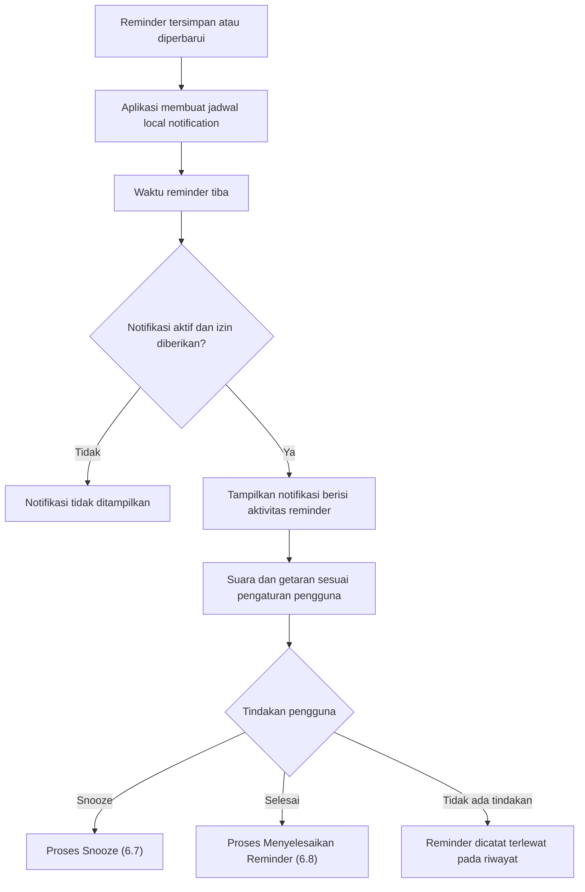

Langkah proses:

1. Setelah reminder disimpan atau diubah, aplikasi menjadwalkan local notification berdasarkan tanggal, waktu, dan pengulangan.
2. Penjadwalan dijalankan pada perangkat sehingga notifikasi tetap dapat muncul tanpa aplikasi dibuka secara terus-menerus.
3. Ketika waktu reminder tiba, aplikasi memeriksa status notifikasi pada pengaturan dan izin notifikasi perangkat.
4. Apabila notifikasi aktif dan izin diberikan, perangkat menampilkan notifikasi yang memuat aktivitas reminder, dengan suara dan getaran sesuai pengaturan pengguna.
5. Pengguna memilih **Snooze** atau **Selesai**. Reminder yang tidak diselesaikan dicatat sebagai `terlewat` pada riwayat (lihat 2.4.4).

Penampilan notifikasi bergantung pada izin dan konfigurasi sistem operasi perangkat (SKPL-NF-017). Ketentuan waktu yang menentukan kapan reminder dianggap terlewat belum ditetapkan pada SKPL dan ditentukan pada tahap implementasi.

## 6.7 Proses Snooze

**Aktor:** Pengguna  
**Acuan SKPL:** SKPL-F-018, SKPL-F-019, SKPL-F-047

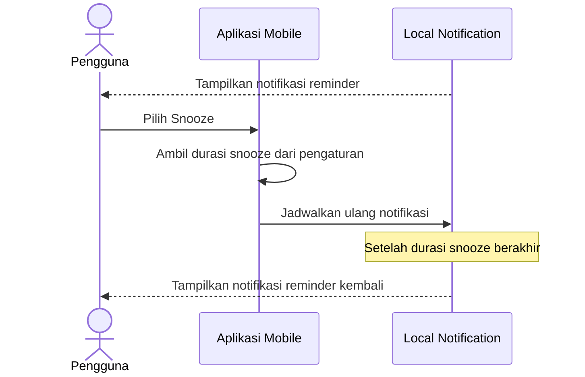

Langkah proses:

1. Pengguna memilih **Snooze** pada notifikasi reminder.
2. Aplikasi mengambil durasi snooze default dari pengaturan pengguna.
3. Aplikasi menjadwalkan ulang notifikasi reminder yang sama sesuai durasi tersebut.
4. Setelah durasi snooze berakhir, notifikasi ditampilkan kembali.

Snooze tidak mengubah reminder menjadi selesai; reminder tetap berstatus `aktif` sampai pengguna menandainya selesai atau reminder tercatat terlewat.

## 6.8 Proses Menyelesaikan Reminder

**Aktor:** Pengguna  
**Acuan SKPL:** SKPL-F-020, SKPL-F-021, SKPL-F-040, SKPL-F-041

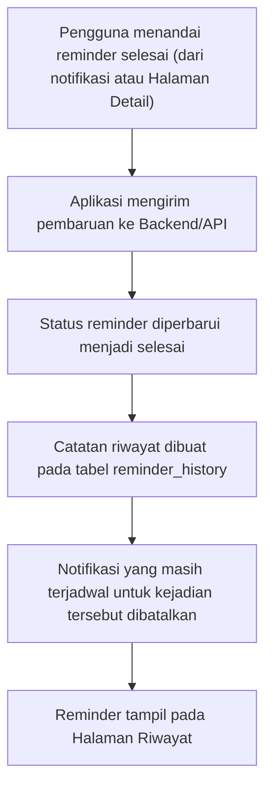

Langkah proses:

1. Pengguna menandai reminder sebagai selesai melalui notifikasi atau Halaman Detail Reminder.
2. Aplikasi mengirim pembaruan ke backend/API, dan status reminder diubah menjadi `selesai`.
3. Sistem membuat catatan pada `reminder_history` dengan status `selesai`, waktu selesai (`completed_at`), dan waktu pencatatan (`recorded_at`).
4. Notifikasi yang masih terjadwal untuk kejadian tersebut dibatalkan.
5. Reminder dapat dilihat pada Halaman Riwayat.

Pada reminder berulang, notifikasi berikutnya tetap dijadwalkan sesuai pengaturan pengulangan (lihat 3.2.6). Pencatatan status per kejadian pada reminder berulang ditentukan pada tahap implementasi.
---

# 7. Perancangan Integrasi AI
 
## 7.1 Tujuan Integrasi AI
 
Integrasi AI pada Eling menggunakan **Google Gemini API** pada fitur **AI Reminder Assistant**. Tujuannya adalah membantu pengguna membuat reminder dari input bahasa natural, sehingga pengguna tidak perlu mengisi aktivitas, tanggal, waktu, dan pengulangan satu per satu.
 
Contoh input pengguna:
 
> "Besok jam 7 pagi ingatkan saya untuk mengerjakan tugas pemrograman."
 
AI hanya berperan **memahami input pengguna**. Hal-hal berikut tetap dikendalikan oleh sistem:
 
- validasi data reminder;
- penyimpanan data;
- pengaturan alarm dan notifikasi;
- perubahan dan penghapusan reminder;
- pengelolaan status dan riwayat reminder.
Batasan integrasi AI (sesuai SKPL Bagian 1.2 dan 2.5):
 
- AI tidak melakukan analisis produktivitas atau pola kebiasaan pengguna;
- AI tidak memberikan rekomendasi atau prediksi aktivitas;
- hasil AI tidak langsung menjadi reminder aktif, dan hanya disimpan setelah pengguna memberikan konfirmasi;
- reminder manual tetap dapat digunakan tanpa AI.
## 7.2 Input AI
 
Input yang diproses AI adalah **teks reminder dari pengguna**. Teks dapat berasal dari dua sumber:
 
1. hasil Speech-to-Text yang telah diperiksa atau diubah pengguna (Bab 8);
2. teks yang diketik langsung oleh pengguna.
Ketentuan input:
 
- aplikasi mengirim teks input ke backend/API, kemudian backend meneruskannya ke Google Gemini API;
- ekspresi waktu relatif seperti "besok" memerlukan tanggal dan waktu saat ini sebagai acuan, sehingga sistem menyertakan informasi tersebut pada permintaan (tanggal dan waktu pada perangkat diasumsikan benar, sesuai SKPL Bagian 2.6);
- data yang dikirim dibatasi pada informasi yang diperlukan untuk memproses reminder dan tidak menyertakan data pribadi lain seperti email atau kata sandi (SKPL-NF-012 dan SKPL Bagian 3.1.4);
- teks input yang kosong tidak dikirim ke AI dan aplikasi meminta pengguna mengisi input terlebih dahulu.
## 7.3 Output AI
 
Output AI berupa informasi reminder yang dikenali dari teks input:
 
| Informasi | Keterangan | Kebutuhan SKPL |
| --- | --- | --- |
| Aktivitas atau judul | Kegiatan yang harus diingat. | SKPL-F-029 |
| Tanggal | Tanggal reminder, apabila tersedia pada teks. | SKPL-F-030 |
| Waktu | Waktu reminder, apabila tersedia pada teks. | SKPL-F-031 |
| Pengulangan | Pola pengulangan reminder, apabila tersedia. | SKPL-F-032 |
 
Informasi yang tidak terdapat pada teks input dikembalikan kosong dan tidak ditebak oleh AI. Pengguna melengkapinya pada halaman Preview AI (Bagian 5.7). Kategori tidak termasuk output AI dan dipilih oleh pengguna.
 
Output AI ditampilkan sebagai preview. Sistem tidak menyimpannya sebagai reminder aktif sebelum pengguna memberikan konfirmasi (SKPL-F-033, SKPL-F-034, dan SKPL-F-035).
 
## 7.4 Format Data AI
 
Backend meminta AI mengembalikan hasil dalam format JSON agar dapat diproses oleh aplikasi.
 
**Permintaan dari aplikasi ke backend:**
 
```json
{
  "text": "Besok jam 7 pagi ingatkan saya untuk mengerjakan tugas pemrograman",
  "current_datetime": "2027-01-17T20:00:00"
}
```
 
**Respons dari backend ke aplikasi:**
 
```json
{
  "status": "success",
  "result": {
    "title": "Mengerjakan tugas pemrograman",
    "date": "2027-01-18",
    "time": "07:00",
    "repeat": "sekali"
  }
}
```
 
Contoh di atas mengasumsikan tanggal pengguna saat input adalah 17-01-2027, sehingga "besok" dikenali sebagai 18-01-2027 sesuai contoh pada README.
 
Ketentuan format:
 
| Field | Tipe | Keterangan |
| --- | --- | --- |
| `title` | teks | Aktivitas atau judul reminder. Bernilai `null` apabila tidak dikenali. |
| `date` | teks (YYYY-MM-DD) | Tanggal reminder. Bernilai `null` apabila tidak tersedia pada input. |
| `time` | teks (HH:MM) | Waktu reminder. Bernilai `null` apabila tidak tersedia pada input. |
| `repeat` | teks | Salah satu pilihan pengulangan pada SKPL-F-014: `sekali`, `setiap hari`, `hari kerja`, `mingguan`, atau pengulangan tertentu. Input tanpa pengulangan bernilai `sekali`. |
 
Sebelum ditampilkan sebagai preview, hasil AI diperiksa terhadap format di atas. Hasil yang tidak sesuai format diperlakukan sebagai kegagalan pemrosesan (Bagian 7.6).
 
## 7.5 Alur Integrasi AI
 
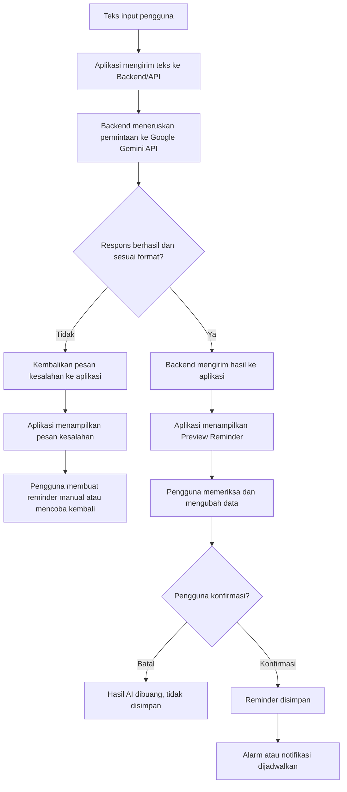
 
Pada alur ini:
 
- kredensial Google Gemini API hanya digunakan pada backend dan tidak disimpan pada aplikasi mobile (SKPL-NF-011);
- aplikasi menampilkan indikator proses selama permintaan berlangsung (SKPL-NF-005);
- penyimpanan reminder hanya terjadi setelah konfirmasi pengguna.
## 7.6 Penanganan Kesalahan AI
 
| Kondisi | Penanganan |
| --- | --- |
| Tidak ada koneksi internet | Aplikasi menampilkan pesan bahwa fitur AI membutuhkan koneksi internet. |
| Layanan Google Gemini API tidak tersedia atau gagal | Aplikasi menampilkan pesan kesalahan (SKPL-F-036). |
| Pemrosesan melebihi batas waktu | Aplikasi menghentikan indikator proses dan menampilkan pesan kesalahan (SKPL-NF-006). |
| Respons tidak sesuai format | Hasil tidak ditampilkan sebagai preview, dan aplikasi menampilkan pesan bahwa input tidak dapat diproses. |
| Sebagian informasi tidak dikenali | Preview tetap ditampilkan dengan isian terkait kosong agar dapat dilengkapi pengguna. |
 
Pada seluruh kondisi di atas:
 
- tidak ada reminder yang tersimpan tanpa konfirmasi pengguna;
- teks input pengguna tetap dapat digunakan kembali untuk mencoba ulang;
- pengguna tetap dapat membuat reminder secara manual (SKPL-F-037 dan SKPL-NF-008);
- pesan kesalahan disampaikan dengan jelas (SKPL-NF-016).
---
 
# 8. Perancangan Speech-to-Text
 
## 8.1 Tujuan
 
Fitur Speech-to-Text memungkinkan pengguna membuat reminder menggunakan suara tanpa mengetik secara manual. Suara pengguna diubah menjadi teks, kemudian teks tersebut dapat diteruskan ke AI Reminder Assistant (Bab 7).
 
Contoh penggunaan:
 
> Pengguna mengatakan: "Jam 8 malam ingatkan saya untuk mengerjakan laporan."
 
## 8.2 Teknologi dan Integrasi
 
- **Teknologi:** layanan Speech-to-Text API/Service yang kompatibel dengan perangkat mobile;
- **Integrasi:** langsung pada aplikasi Flutter, sesuai alur pada Gambaran Umum Arsitektur (Bagian 2.1) yang menunjukkan aplikasi mobile berkomunikasi dengan layanan Speech-to-Text;
- **Perangkat keras:** mikrofon pada perangkat;
- **Koneksi:** internet diperlukan (SKPL Bagian 2.4).
Layanan atau pustaka Speech-to-Text yang digunakan, serta bahasa pengenalan suara, ditentukan pada tahap implementasi sesuai kompatibilitas dengan Flutter dan perangkat Android.
 
## 8.3 Alur Proses
 
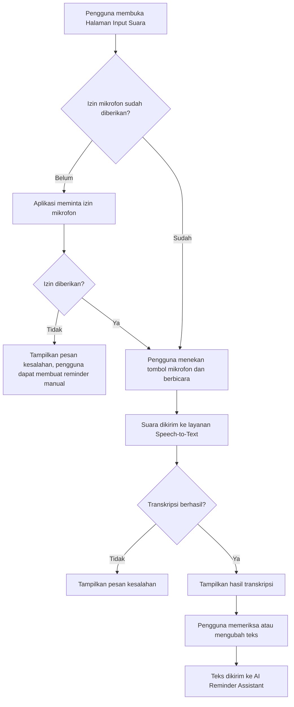
 
## 8.4 Input dan Output
 
| Aspek | Keterangan |
| --- | --- |
| Input | Suara pengguna melalui mikrofon perangkat. |
| Output | Teks hasil transkripsi yang ditampilkan pada Halaman Input Suara. |
| Tindak lanjut | Teks yang telah diperiksa pengguna dikirim ke AI Reminder Assistant. |
 
Hasil transkripsi **tidak otomatis dikirim ke AI**. Teks ditampilkan terlebih dahulu sehingga pengguna dapat memperbaiki kesalahan pengenalan suara (SKPL-F-025 dan SKPL-F-026).
 
## 8.5 Penanganan Kesalahan
 
| Kondisi | Penanganan |
| --- | --- |
| Izin mikrofon ditolak | Aplikasi menampilkan pesan bahwa izin mikrofon diperlukan, dan pengguna dapat membuat reminder manual. |
| Tidak ada koneksi internet | Aplikasi menampilkan pesan kesalahan. |
| Suara tidak terdeteksi atau tidak dapat dikenali | Aplikasi menampilkan pesan kesalahan dan pengguna dapat mengulang perekaman. |
| Proses melebihi batas waktu | Aplikasi menghentikan indikator proses dan menampilkan pesan kesalahan (SKPL-NF-006). |
 
Selama proses berlangsung, aplikasi menampilkan indikator proses (SKPL-NF-005). Kegagalan Speech-to-Text tidak mengganggu pembuatan reminder manual (SKPL-F-027, SKPL-NF-008, dan SKPL-NF-016).
 
## 8.6 Pemetaan Kebutuhan
 
| Kebutuhan SKPL | Rancangan |
| --- | --- |
| SKPL-F-023 | Halaman Input Suara (Bagian 5.6) |
| SKPL-F-024 | Integrasi layanan Speech-to-Text (Bagian 8.2 dan 8.3) |
| SKPL-F-025, SKPL-F-026 | Penampilan dan pengubahan hasil transkripsi (Bagian 8.4) |
| SKPL-F-027 | Penanganan kesalahan (Bagian 8.5) |
 
---
 
# 9. Perancangan API
 
## 9.1 Gambaran Umum
 
Komunikasi antara aplikasi Flutter dan backend dilakukan melalui REST API menggunakan HTTPS. Backend menggunakan **Supabase**, yang menyediakan layanan autentikasi, akses data PostgreSQL melalui API, dan pengelolaan akses data pengguna.
 
Rancangan API dibagi menjadi tiga kelompok:
 
1. **API autentikasi**, disediakan oleh Supabase Auth;
2. **API data**, untuk pengelolaan reminder, kategori, riwayat, pengaturan, dan profil;
3. **API pemrosesan AI**, untuk meneruskan teks input ke Google Gemini API.
Speech-to-Text tidak melalui API backend karena diproses langsung oleh aplikasi mobile dengan layanan Speech-to-Text (Bab 8).
 
Nama resource pada bagian ini bersifat logis. Nama tabel, kolom, dan path final mengikuti rancangan basis data (Bab 4) dan implementasi.
 
## 9.2 Autentikasi dan Otorisasi
 
- pengguna melakukan registrasi dan login melalui Supabase Auth;
- setelah login, aplikasi menerima token akses yang dikirim pada setiap permintaan ke API data dan API pemrosesan AI;
- permintaan tanpa token yang valid ditolak;
- akses data dibatasi berdasarkan akun pengguna, sehingga pengguna hanya dapat mengakses data miliknya sendiri (SKPL-F-003 dan SKPL-NF-009);
- seluruh komunikasi menggunakan HTTPS dan kredensial tidak dikirim dalam bentuk yang tidak aman (SKPL-NF-010).
## 9.3 Daftar API
 
### 9.3.1 API Autentikasi dan Profil
 
| Operasi | Metode | Resource | Keterangan | SKPL |
| --- | --- | --- | --- | --- |
| Registrasi | POST | auth (signup) | Membuat akun dengan nama, email, dan kata sandi. | SKPL-F-001 |
| Login | POST | auth (login) | Menghasilkan token akses. | SKPL-F-002 |
| Logout | POST | auth (logout) | Mengakhiri sesi pengguna. | SKPL-F-002 |
| Melihat profil | GET | profile | Mengambil profil pengguna yang sedang login. | SKPL-F-004, SKPL-F-048 |
| Mengubah profil | PATCH | profile | Mengubah data profil pengguna yang sedang login. | SKPL-F-005, SKPL-F-048 |
 
### 9.3.2 API Reminder
 
| Operasi | Metode | Resource | Keterangan | SKPL |
| --- | --- | --- | --- | --- |
| Membuat reminder | POST | reminders | Menyimpan reminder baru, baik manual maupun hasil konfirmasi AI. | SKPL-F-006 s.d. SKPL-F-009, SKPL-F-013 |
| Melihat daftar reminder | GET | reminders | Mengambil reminder milik pengguna. | SKPL-F-012 |
| Melihat detail reminder | GET | reminders/{id} | Mengambil satu reminder. | SKPL-F-015 |
| Mengubah reminder | PATCH | reminders/{id} | Mengubah data reminder. | SKPL-F-010 |
| Menghapus reminder | DELETE | reminders/{id} | Menghapus reminder. | SKPL-F-011 |
| Mengubah status reminder | PATCH | reminders/{id} | Menandai reminder selesai atau terlewat. | SKPL-F-020, SKPL-F-021 |
| Mencari reminder | GET | reminders | Penyaringan berdasarkan kata kunci. | SKPL-F-042 |
| Menyaring berdasarkan kategori | GET | reminders | Penyaringan berdasarkan kategori. | SKPL-F-043 |
 
### 9.3.3 API Kategori, Riwayat, dan Pengaturan
 
| Operasi | Metode | Resource | Keterangan | SKPL |
| --- | --- | --- | --- | --- |
| Melihat kategori | GET | categories | Mengambil daftar kategori. | SKPL-F-039 |
| Melihat riwayat | GET | reminder history | Mengambil reminder berstatus selesai atau terlewat. | SKPL-F-040, SKPL-F-041 |
| Mencatat riwayat | POST | reminder history | Mencatat status selesai atau terlewat. | SKPL-F-021, SKPL-F-041 |
| Melihat pengaturan | GET | settings | Mengambil pengaturan notifikasi pengguna. | SKPL-F-044 s.d. SKPL-F-047 |
| Mengubah pengaturan | PATCH | settings | Mengubah status notifikasi, suara, getaran, dan durasi snooze. | SKPL-F-044 s.d. SKPL-F-047 |
 
### 9.3.4 API Pemrosesan AI
 
| Operasi | Metode | Resource | Keterangan | SKPL |
| --- | --- | --- | --- | --- |
| Memproses teks reminder | POST | AI processing | Menerima teks input, meneruskannya ke Google Gemini API, dan mengembalikan hasil pengenalan reminder. | SKPL-F-028 s.d. SKPL-F-032 |
 
Permintaan dan respons API ini mengikuti format pada Bagian 7.4. API ini **hanya mengembalikan hasil untuk preview** dan tidak menyimpan reminder. Penyimpanan dilakukan melalui API Reminder setelah pengguna memberikan konfirmasi (SKPL-F-035).
 
## 9.4 Format Respons Kesalahan
 
Setiap kegagalan dikembalikan dengan kode status HTTP yang sesuai dan pesan yang dapat ditampilkan aplikasi.
 
| Kondisi | Kode Status HTTP | Penanganan Aplikasi |
| --- | --- | --- |
| Data tidak valid | 400 | Menampilkan pesan validasi. |
| Token tidak valid atau tidak ada | 401 | Mengarahkan pengguna ke halaman Login. |
| Akses ke data milik pengguna lain | 403 | Menampilkan pesan bahwa akses ditolak. |
| Data tidak ditemukan | 404 | Menampilkan pesan data tidak ditemukan. |
| Layanan AI gagal atau tidak tersedia | 5xx | Menampilkan pesan kesalahan AI dan menawarkan reminder manual. |
 
Contoh respons kesalahan:
 
```json
{
  "status": "error",
  "message": "Layanan AI tidak tersedia. Silakan buat reminder secara manual."
}
```
 
Pesan kesalahan ditampilkan secara jelas kepada pengguna sesuai SKPL-NF-016.
 
## 9.5 Ketentuan Penggunaan API
 
- API data hanya mengembalikan data milik pengguna yang sedang login;
- data reminder divalidasi sebelum disimpan (SKPL-NF-015);
- API key layanan AI hanya berada pada sisi backend (SKPL-NF-011);
- data yang diteruskan ke layanan AI dibatasi pada kebutuhan pemrosesan reminder (SKPL-NF-012);
- kegagalan API pemrosesan AI tidak mempengaruhi API Reminder sehingga reminder manual tetap dapat dibuat (SKPL-NF-008).
| SKPL-F-028 s.d. SKPL-F-037 | `ai_requests`, `reminders` |
 
---
