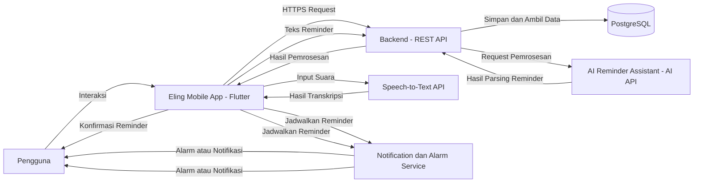
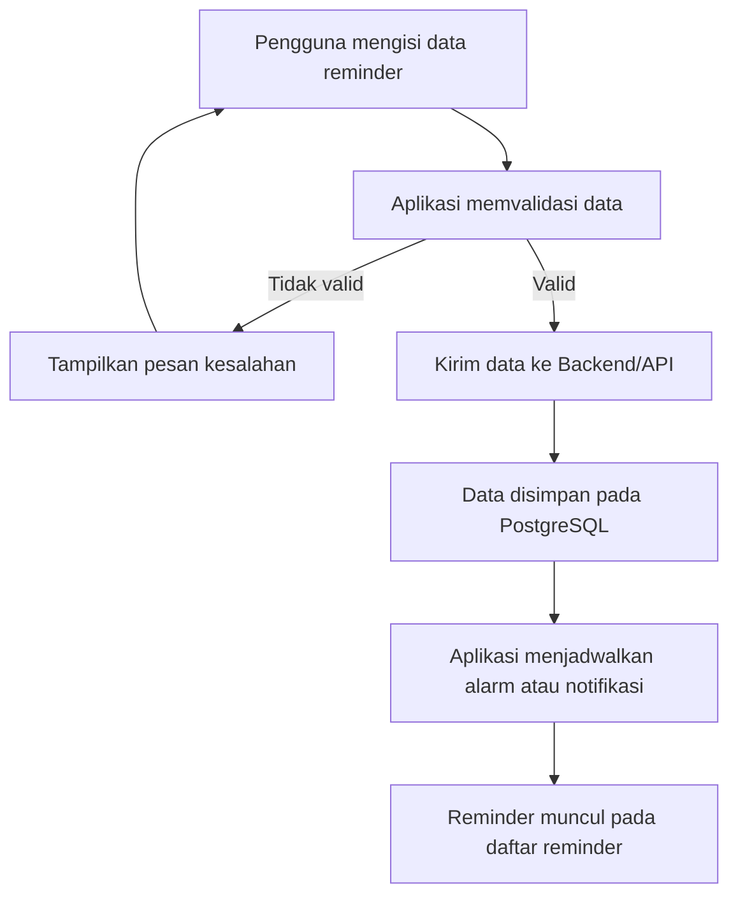
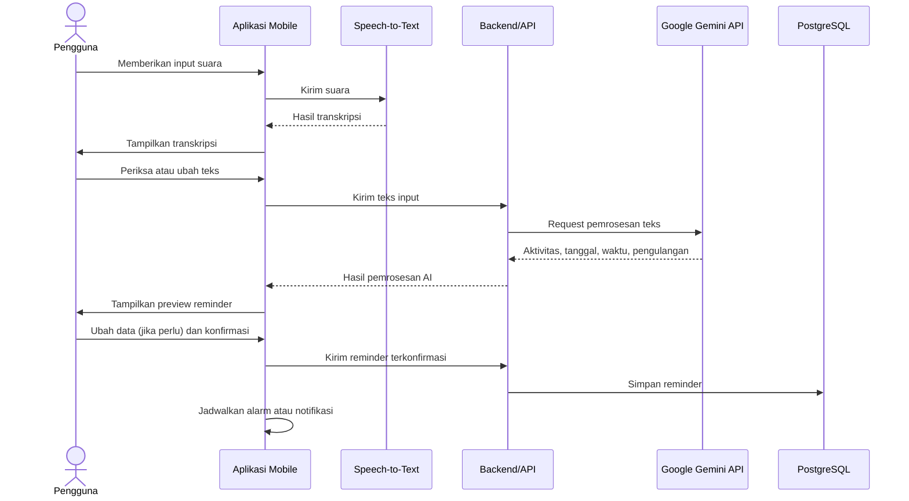

# Deskripsi Perancangan Perangkat Lunak (DPPL)

**Eling – Aplikasi Mobile Pengingat Harian Berbasis AI**

---

# Daftar Isi

1. [Pendahuluan](#1-pendahuluan)
   - [1.1 Tujuan Dokumen](#11-tujuan-dokumen)
   - [1.2 Ruang Lingkup Perancangan](#12-ruang-lingkup-perancangan)
   - [1.3 Referensi](#13-referensi)

2. [Deskripsi Arsitektur Sistem](#2-deskripsi-arsitektur-sistem)
   - [2.1 Gambaran Umum Arsitektur](#21-gambaran-umum-arsitektur)
   - [2.2 Arsitektur Sistem](#22-arsitektur-sistem)
   - [2.3 Komponen Sistem](#23-komponen-sistem)
   - [2.4 Alur Data Sistem](#24-alur-data-sistem)

3. [Perancangan Modul Sistem](#3-perancangan-modul-sistem)
   - [3.1 Modul Autentikasi](#31-modul-autentikasi)
   - [3.2 Modul Manajemen Reminder](#32-modul-manajemen-reminder)
   - [3.3 Modul Alarm dan Notifikasi](#33-modul-alarm-dan-notifikasi)
   - [3.4 Modul Speech-to-Text](#34-modul-speech-to-text)
   - [3.5 Modul AI Reminder Assistant](#35-modul-ai-reminder-assistant)
   - [3.6 Modul Kategori](#36-modul-kategori)
   - [3.7 Modul Riwayat Reminder](#37-modul-riwayat-reminder)
   - [3.8 Modul Pencarian](#38-modul-pencarian)
   - [3.9 Modul Pengaturan](#39-modul-pengaturan)

4. [Perancangan Basis Data](#4-perancangan-basis-data)
   - [4.1 Gambaran Basis Data](#41-gambaran-basis-data)
   - [4.2 Entitas Basis Data](#42-entitas-basis-data)
   - [4.3 Relasi Antarentitas](#43-relasi-antarentitas)
   - [4.4 Struktur Tabel](#44-struktur-tabel)

5. [Perancangan Antarmuka](#5-perancangan-antarmuka)
   - [5.1 Prinsip Perancangan Antarmuka](#51-prinsip-perancangan-antarmuka)
   - [5.2 Halaman Login](#52-halaman-login)
   - [5.3 Halaman Registrasi](#53-halaman-registrasi)
   - [5.4 Halaman Utama](#54-halaman-utama)
   - [5.5 Halaman Tambah Reminder](#55-halaman-tambah-reminder)
   - [5.6 Halaman Input Suara](#56-halaman-input-suara)
   - [5.7 Halaman Preview AI](#57-halaman-preview-ai)
   - [5.8 Halaman Detail Reminder](#58-halaman-detail-reminder)
   - [5.9 Halaman Riwayat](#59-halaman-riwayat)
   - [5.10 Halaman Pengaturan](#510-halaman-pengaturan)

6. [Perancangan Proses Sistem](#6-perancangan-proses-sistem)
   - [6.1 Proses Login](#61-proses-login)
   - [6.2 Proses Membuat Reminder Manual](#62-proses-membuat-reminder-manual)
   - [6.3 Proses Membuat Reminder dengan Suara](#63-proses-membuat-reminder-dengan-suara)
   - [6.4 Proses Pemrosesan AI](#64-proses-pemrosesan-ai)
   - [6.5 Proses Konfirmasi Reminder](#65-proses-konfirmasi-reminder)
   - [6.6 Proses Alarm dan Notifikasi](#66-proses-alarm-dan-notifikasi)
   - [6.7 Proses Snooze](#67-proses-snooze)
   - [6.8 Proses Menyelesaikan Reminder](#68-proses-menyelesaikan-reminder)

7. [Perancangan Integrasi AI](#7-perancangan-integrasi-ai)
   - [7.1 Tujuan Integrasi AI](#71-tujuan-integrasi-ai)
   - [7.2 Input AI](#72-input-ai)
   - [7.3 Output AI](#73-output-ai)
   - [7.4 Format Data AI](#74-format-data-ai)
   - [7.5 Alur Integrasi AI](#75-alur-integrasi-ai)
   - [7.6 Penanganan Kesalahan AI](#76-penanganan-kesalahan-ai)

8. [Perancangan Speech-to-Text](#8-perancangan-speech-to-text)

9. [Perancangan API](#9-perancangan-api)

10. [Perancangan Keamanan](#10-perancangan-keamanan)

11. [Perancangan Deployment](#11-perancangan-deployment)

12. [Pemetaan SKPL terhadap Perancangan](#12-pemetaan-skpl-terhadap-perancangan)

---

# 1. Pendahuluan

## 1.1 Tujuan Dokumen

Dokumen Deskripsi Perancangan Perangkat Lunak (DPPL) ini menjelaskan rancangan teknis dari **Eling**, yaitu aplikasi mobile pengingat aktivitas harian berbasis AI.

Dokumen ini digunakan sebagai acuan dalam proses implementasi perangkat lunak berdasarkan kebutuhan yang telah didefinisikan pada dokumen SKPL.

DPPL menjelaskan rancangan:

- arsitektur sistem;
- modul perangkat lunak;
- basis data;
- antarmuka pengguna;
- proses sistem;
- integrasi AI;
- Speech-to-Text;
- API;
- keamanan;
- deployment.

## 1.2 Ruang Lingkup Perancangan

Perancangan Eling mencakup fitur:

- autentikasi pengguna;
- pengelolaan profil;
- pembuatan reminder;
- pengubahan reminder;
- penghapusan reminder;
- reminder berulang;
- alarm dan notifikasi;
- snooze;
- penyelesaian reminder;
- Speech-to-Text;
- AI Reminder Assistant;
- preview hasil AI;
- konfirmasi hasil AI;
- kategori reminder;
- riwayat reminder;
- pencarian reminder;
- pengaturan notifikasi.

AI digunakan sebagai fitur pendukung untuk membantu pengguna membuat reminder dari input bahasa natural.

Sistem tidak merancang fitur:

- analisis pola kebiasaan;
- insight produktivitas;
- prediksi kebiasaan;
- rekomendasi aktivitas otomatis.

## 1.3 Referensi

Dokumen utama yang digunakan sebagai dasar perancangan adalah:

1. Spesifikasi Kebutuhan Perangkat Lunak (SKPL) Eling.
2. Kebutuhan fungsional dan nonfungsional yang telah didefinisikan pada SKPL.
3. Rancangan penggunaan Flutter sebagai framework aplikasi mobile.
4. Rancangan penggunaan PostgreSQL sebagai basis data.
5. Rancangan penggunaan layanan AI melalui API.

---

# 2. Deskripsi Arsitektur Sistem

## 2.1 Gambaran Umum Arsitektur

Eling menggunakan arsitektur aplikasi yang terdiri dari tiga bagian utama:

1. **Mobile Application**
2. **Backend/API**
3. **External Services**

Mobile Application digunakan oleh pengguna untuk melakukan interaksi dengan sistem.

Backend/API digunakan untuk mengelola autentikasi, data reminder, kategori, riwayat, serta komunikasi dengan layanan eksternal.

External Services digunakan untuk layanan yang membutuhkan pemrosesan khusus, yaitu:

- layanan AI;
- layanan Speech-to-Text.

Gambaran umum arsitektur:



## 2.2 Arsitektur Sistem
 
Arsitektur Eling dibagi menjadi beberapa lapisan berdasarkan tanggung jawab masing-masing komponen. Pembagian tersebut bertujuan agar sistem lebih mudah dikembangkan, dipelihara, dan diuji.
 
### 2.2.1 Lapisan Presentasi
 
Lapisan presentasi berada pada aplikasi mobile Flutter dan bertanggung jawab terhadap interaksi langsung dengan pengguna. Fungsi utama lapisan ini meliputi:
 
- menampilkan halaman aplikasi;
- menerima input pengguna;
- menampilkan daftar reminder;
- menampilkan detail reminder;
- menampilkan hasil Speech-to-Text;
- menampilkan preview hasil AI;
- menerima konfirmasi pengguna;
- menampilkan notifikasi dan status reminder;
- menyediakan navigasi antarhalaman.
Lapisan ini tidak bertanggung jawab langsung terhadap penyimpanan permanen data. Data yang membutuhkan penyimpanan akan diteruskan melalui mekanisme komunikasi dengan backend/API.
 
### 2.2.2 Lapisan Aplikasi
 
Lapisan aplikasi menangani logika utama yang berkaitan dengan proses reminder. Fungsi lapisan aplikasi meliputi:
 
- validasi data reminder;
- pembuatan reminder;
- perubahan reminder;
- penghapusan reminder;
- pengaturan reminder berulang;
- pengelolaan status reminder;
- pengelolaan kategori;
- pengelolaan riwayat;
- pencarian reminder;
- pengelolaan proses konfirmasi hasil AI.
Lapisan ini memastikan bahwa data yang akan disimpan telah memenuhi aturan yang ditentukan oleh sistem.
 
### 2.2.3 Lapisan Backend/API
 
Lapisan backend/API berfungsi sebagai penghubung antara aplikasi mobile dengan layanan backend dan layanan eksternal. Pada Eling, backend menggunakan **Supabase** untuk menyediakan layanan:
 
- autentikasi pengguna;
- akses data melalui API;
- pengelolaan basis data;
- pengelolaan akses terhadap data pengguna.
Backend juga menjadi bagian dari jalur komunikasi pemrosesan AI. Input reminder yang telah diberikan oleh pengguna dapat diteruskan ke layanan Google Gemini API melalui backend/API. Dengan pendekatan tersebut, kredensial layanan AI tidak ditempatkan secara langsung pada aplikasi mobile.
 
### 2.2.4 Lapisan Data
 
Lapisan data menggunakan **PostgreSQL melalui Supabase**.Lapisan ini digunakan untuk menyimpan data secara permanen, antara lain:
 
- data pengguna;
- data reminder;
- data kategori;
- data riwayat reminder;
- data pengaturan pengguna;
- data lain yang diperlukan untuk mendukung fungsi aplikasi.
Data reminder dikaitkan dengan pengguna sehingga sistem dapat membatasi akses berdasarkan akun yang sedang digunakan.
 
### 2.2.5 Lapisan Layanan Eksternal
 
Lapisan layanan eksternal terdiri dari layanan yang tidak dijalankan secara langsung oleh aplikasi Eling. Layanan tersebut meliputi:
 
1. **Google Gemini API**, digunakan untuk membantu memahami input reminder dalam bahasa natural.
2. **Speech-to-Text Service**, digunakan untuk mengubah suara pengguna menjadi teks.
Penggunaan layanan eksternal dilakukan hanya ketika fitur yang bersangkutan digunakan oleh pengguna.
 
### 2.2.6 Lapisan Perangkat
 
Beberapa fungsi Eling memanfaatkan kemampuan perangkat mobile, yaitu:
 
- mikrofon untuk input suara;
- layar sentuh untuk interaksi;
- sistem notifikasi perangkat;
- speaker untuk suara notifikasi atau alarm;
- penyimpanan dan konfigurasi perangkat yang diperlukan oleh mekanisme notifikasi.
Local notification dijalankan pada perangkat pengguna berdasarkan reminder yang telah dikonfirmasi dan dijadwalkan.
 
## 2.3 Komponen Sistem
 
Komponen sistem Eling disusun berdasarkan teknologi yang telah ditetapkan pada rancangan project dan kebutuhan yang didefinisikan pada SKPL.
 
### 2.3.1 Komponen Utama
 
| Komponen | Teknologi | Tanggung Jawab |
| --- | --- | --- |
| Aplikasi Mobile Eling | Flutter, Dart | Menampilkan antarmuka, menerima input pengguna, memvalidasi data reminder, mengelola proses konfirmasi hasil AI, serta menjadwalkan alarm dan notifikasi pada perangkat. |
| Backend/API | Supabase, REST API | Menyediakan akses data melalui API, mengelola hak akses data berdasarkan akun pengguna, dan meneruskan input reminder ke layanan AI. |
| Autentikasi | Supabase Auth | Menangani registrasi, login, logout, dan autentikasi pengguna. |
| Basis Data | PostgreSQL (melalui Supabase) | Menyimpan data pengguna, reminder, kategori, riwayat reminder, dan pengaturan pengguna. |
| AI Reminder Assistant | Google Gemini API | Membantu mengenali aktivitas, tanggal, waktu, dan pengulangan dari teks input bahasa natural. |
| Speech-to-Text | Speech-to-Text API/Service, terintegrasi pada Flutter | Mengubah suara pengguna menjadi teks. |
| Local Notification dan Alarm | Local Notification, terintegrasi pada Flutter | Memberikan alarm atau notifikasi pada waktu reminder, termasuk ketika aplikasi tidak sedang dibuka. |
| Perangkat Android | Mikrofon, speaker, layar sentuh, sistem notifikasi | Menyediakan perangkat keras yang dibutuhkan untuk input suara, suara alarm, interaksi, dan penampilan notifikasi. |
 
### 2.3.2 Komponen Internal Aplikasi
 
Fungsi aplikasi dibagi ke dalam modul-modul berikut. Perancangan setiap modul dijelaskan pada Bab 3.
 
| Modul | Fungsi Utama | Fitur Terkait |
| --- | --- | --- |
| Modul Autentikasi | Registrasi, login, logout, dan pengelolaan profil pengguna. | Autentikasi dan manajemen pengguna |
| Modul Manajemen Reminder | Membuat, melihat, mengubah, menghapus reminder, serta mengatur pengulangan. | Manajemen reminder, reminder berulang |
| Modul Alarm dan Notifikasi | Menjadwalkan notifikasi, melakukan snooze, dan menandai reminder selesai. | Alarm dan notifikasi |
| Modul Speech-to-Text | Menerima input suara dan menampilkan hasil transkripsi. | Speech-to-Text |
| Modul AI Reminder Assistant | Mengirim teks input, menerima hasil pemrosesan AI, menampilkan preview, dan meminta konfirmasi. | AI Reminder Assistant, AI Reminder Preview |
| Modul Kategori | Mengelompokkan reminder berdasarkan kategori. | Kategori reminder |
| Modul Riwayat Reminder | Menampilkan reminder yang selesai atau terlewat. | Riwayat reminder |
| Modul Pencarian | Mencari reminder berdasarkan kata kunci dan kategori. | Pencarian reminder |
| Modul Pengaturan | Mengatur status notifikasi, suara, getaran, dan durasi snooze. | Pengaturan reminder dan notifikasi |
 
### 2.3.3 Hubungan Antarkomponen
 
- Aplikasi mobile berkomunikasi dengan backend/API melalui HTTPS.
- Aplikasi mobile berkomunikasi dengan layanan Speech-to-Text untuk mengubah suara menjadi teks.
- Backend/API berkomunikasi dengan Google Gemini API untuk memproses teks input reminder, sehingga kredensial layanan AI tidak disimpan pada aplikasi mobile.
- Backend/API menyimpan dan mengambil data pada PostgreSQL.
- Aplikasi mobile menjadwalkan alarm dan notifikasi melalui mekanisme local notification pada perangkat.
## 2.4 Alur Data Sistem
 
Bagian ini menjelaskan alur data pada fungsi-fungsi utama Eling. Penjelasan langkah proses yang lebih rinci dibahas pada Bab 6.
 
### 2.4.1 Alur Autentikasi
 
1. Pengguna memasukkan data registrasi atau login pada aplikasi mobile.
2. Aplikasi mengirim data tersebut ke layanan autentikasi pada backend.
3. Backend memverifikasi data dan mengembalikan hasil autentikasi.
4. Apabila berhasil, pengguna dapat mengakses data reminder miliknya sendiri. Apabila gagal, aplikasi menampilkan pesan kesalahan.
### 2.4.2 Alur Pembuatan Reminder Manual
 

 
### 2.4.3 Alur Pembuatan Reminder dengan Suara dan AI
 

 
Ketentuan pada alur ini:
 
- hasil pemrosesan AI hanya ditampilkan sebagai preview dan belum menjadi reminder aktif;
- reminder baru disimpan setelah pengguna memberikan konfirmasi;
- teks hasil Speech-to-Text dapat diubah pengguna sebelum dikirim ke AI;
- data yang dikirim ke layanan AI dibatasi pada teks input yang diperlukan untuk pemrosesan reminder;
- apabila Speech-to-Text atau layanan AI gagal, aplikasi menampilkan pesan kesalahan dan pengguna tetap dapat membuat reminder secara manual.
### 2.4.4 Alur Alarm dan Notifikasi
 
1. Setelah reminder disimpan, aplikasi menjadwalkan alarm atau notifikasi lokal sesuai tanggal, waktu, dan pengulangan reminder.
2. Ketika waktu reminder tiba, perangkat menampilkan notifikasi yang memuat aktivitas reminder, sesuai pengaturan suara dan getaran pengguna.
3. Pengguna dapat memilih salah satu tindakan:
   - **Snooze**: alarm dijadwalkan kembali sesuai durasi snooze;
   - **Selesai**: status reminder diperbarui menjadi selesai dan dicatat pada riwayat.
4. Reminder yang tidak diselesaikan dicatat dengan status terlewat pada riwayat.
Penjadwalan notifikasi dijalankan pada perangkat sehingga reminder tetap dapat memberikan notifikasi tanpa aplikasi dibuka secara terus-menerus, selama izin notifikasi diberikan pengguna.
 
### 2.4.5 Alur Data Pengelolaan Reminder
 
| Proses | Data Masuk | Data Keluar |
| --- | --- | --- |
| Melihat daftar dan detail reminder | Permintaan pengguna | Data reminder milik pengguna yang sedang login |
| Mengubah reminder | Data reminder yang diperbarui | Data reminder tersimpan dan jadwal notifikasi diperbarui |
| Menghapus reminder | Permintaan hapus | Reminder terhapus dan jadwal notifikasi dibatalkan |
| Mencari reminder | Kata kunci atau kategori | Daftar reminder yang sesuai |
| Melihat riwayat | Permintaan pengguna | Daftar reminder berstatus selesai atau terlewat |
| Mengubah pengaturan | Status notifikasi, suara, getaran, durasi snooze | Pengaturan tersimpan dan digunakan pada penjadwalan berikutnya |
 
Seluruh akses data pada proses di atas dibatasi berdasarkan akun pengguna yang sedang login.
 
---

# 3. Perancangan Modul Sistem

Bab ini menjelaskan rancangan modul perangkat lunak yang digunakan pada aplikasi Eling. Setiap modul dirancang berdasarkan kebutuhan fungsional yang telah didefinisikan pada dokumen SKPL. Pembagian modul dilakukan berdasarkan fungsi utama sistem agar proses implementasi, pengujian, dan pemeliharaan aplikasi dapat dilakukan secara terstruktur.

Modul yang terdapat pada aplikasi Eling meliputi:

1. Modul Autentikasi
2. Modul Manajemen Reminder
3. Modul Alarm dan Notifikasi
4. Modul Speech-to-Text
5. Modul AI Reminder Assistant
6. Modul Kategori
7. Modul Riwayat Reminder
8. Modul Pencarian
9. Modul Pengaturan

---

## 3.1 Modul Autentikasi

Modul Autentikasi digunakan untuk mengelola identitas pengguna dan akses pengguna terhadap aplikasi Eling. Modul ini menggunakan **Supabase Auth** sebagai layanan autentikasi.

Modul autentikasi digunakan pada proses registrasi, login, logout, serta validasi sesi pengguna. Setiap pengguna yang berhasil melakukan autentikasi hanya dapat mengakses data yang berkaitan dengan akun miliknya.

### 3.1.1 Fungsi Modul

Fungsi utama Modul Autentikasi adalah:

* melakukan registrasi akun baru;
* melakukan login pengguna;
* melakukan logout pengguna;
* memvalidasi sesi pengguna;
* mengidentifikasi pengguna yang sedang login;
* membatasi akses data berdasarkan akun pengguna.

### 3.1.2 Input

Data yang digunakan dalam proses autentikasi meliputi:

| Data     | Keterangan                          |
| -------- | ----------------------------------- |
| Nama     | Nama pengguna pada saat registrasi  |
| Email    | Alamat email pengguna               |
| Password | Kata sandi pengguna                 |
| Session  | Informasi sesi autentikasi pengguna |

### 3.1.3 Proses

Pada proses registrasi, pengguna memasukkan nama, email, dan password. Sistem melakukan validasi terhadap data yang dimasukkan sebelum meneruskannya ke Supabase Auth.

Pada proses login, pengguna memasukkan email dan password. Supabase Auth melakukan validasi kredensial. Apabila kredensial benar, sistem membuat sesi pengguna dan memberikan akses ke aplikasi.

Pada proses logout, sesi pengguna diakhiri sehingga pengguna harus melakukan login kembali untuk mengakses data yang membutuhkan autentikasi.

### 3.1.4 Output

Output Modul Autentikasi meliputi:

* akun pengguna berhasil dibuat;
* pengguna berhasil login;
* sesi pengguna aktif;
* pengguna berhasil logout;
* pesan kesalahan apabila proses autentikasi gagal.

### 3.1.5 Alur Modul

```text
Pengguna
    |
    v
Masukkan Email dan Password
    |
    v
Validasi Input
    |
    v
Supabase Auth
    |
    +---- Tidak Valid ----> Pesan Kesalahan
    |
    v
Sesi Pengguna Aktif
    |
    v
Masuk ke Aplikasi
```

---

## 3.2 Modul Manajemen Reminder

Modul Manajemen Reminder merupakan modul utama dalam aplikasi Eling. Modul ini digunakan untuk membuat, melihat, mengubah, dan menghapus reminder.

Pengguna dapat menentukan aktivitas, tanggal, waktu, kategori, serta pengulangan reminder. Reminder yang telah berhasil disimpan akan digunakan oleh sistem untuk menjadwalkan notifikasi.

### 3.2.1 Fungsi Modul

Fungsi utama Modul Manajemen Reminder adalah:

* membuat reminder;
* melihat daftar reminder;
* melihat detail reminder;
* mengubah reminder;
* menghapus reminder;
* menentukan tanggal reminder;
* menentukan waktu reminder;
* menentukan kategori reminder;
* mengatur reminder berulang;
* mengubah status reminder.

### 3.2.2 Input

Data reminder yang digunakan meliputi:

| Data            | Keterangan                      |
| --------------- | ------------------------------- |
| Judul/Aktivitas | Aktivitas yang ingin diingatkan |
| Tanggal         | Tanggal pelaksanaan reminder    |
| Waktu           | Waktu pelaksanaan reminder      |
| Kategori        | Kategori aktivitas              |
| Pengulangan     | Pengaturan reminder berulang    |
| Status          | Status reminder                 |

### 3.2.3 Proses

Pengguna mengisi data reminder melalui halaman tambah reminder. Sistem melakukan validasi terhadap data tersebut.

Apabila data valid, aplikasi mengirimkan data ke backend/API untuk disimpan pada PostgreSQL melalui Supabase.

Setelah data berhasil disimpan, sistem menggunakan informasi tanggal dan waktu untuk menjadwalkan local notification pada perangkat pengguna.

### 3.2.4 Output

Output Modul Manajemen Reminder meliputi:

* reminder berhasil dibuat;
* daftar reminder pengguna;
* detail reminder;
* reminder berhasil diperbarui;
* reminder berhasil dihapus;
* pesan kesalahan apabila proses gagal.

### 3.2.5 Alur Modul

```text
Pengguna
    |
    v
Tambah / Pilih Reminder
    |
    v
Input Data Reminder
    |
    v
Validasi Data
    |
    +---- Tidak Valid ----> Tampilkan Pesan Kesalahan
    |
    v
Backend / API
    |
    v
PostgreSQL
    |
    v
Reminder Tersimpan
    |
    v
Jadwalkan Notifikasi
```

### 3.2.6 Reminder Berulang

Pengguna dapat mengatur reminder agar dilakukan secara berulang.

Pilihan pengulangan yang disediakan meliputi:

* sekali;
* setiap hari;
* hari kerja;
* mingguan;
* pengulangan tertentu.

Informasi pengulangan disimpan bersama data reminder dan digunakan untuk menentukan jadwal notifikasi berikutnya.

---

## 3.3 Modul Alarm dan Notifikasi

Modul Alarm dan Notifikasi bertanggung jawab untuk memberikan pengingat kepada pengguna ketika waktu reminder telah tiba.

Eling menggunakan **local notification** pada perangkat mobile. Dengan mekanisme ini, notifikasi dapat diberikan tanpa pengguna harus membuka aplikasi secara terus-menerus.

### 3.3.1 Fungsi Modul

Fungsi utama modul meliputi:

* menjadwalkan notifikasi;
* menampilkan notifikasi reminder;
* menampilkan aktivitas reminder;
* menjalankan snooze;
* menjadwalkan ulang reminder setelah snooze;
* mendukung penyelesaian reminder.

### 3.3.2 Input

Input Modul Alarm dan Notifikasi meliputi:

| Data              | Keterangan                                 |
| ----------------- | ------------------------------------------ |
| Judul Reminder    | Aktivitas yang ditampilkan pada notifikasi |
| Tanggal           | Tanggal notifikasi                         |
| Waktu             | Waktu notifikasi                           |
| Pengulangan       | Jadwal pengulangan                         |
| Status Notifikasi | Status aktif/nonaktif                      |
| Durasi Snooze     | Durasi penundaan reminder                  |

### 3.3.3 Proses

Setelah reminder berhasil disimpan, sistem membuat jadwal local notification berdasarkan tanggal dan waktu reminder.

Ketika waktu reminder tiba, sistem menampilkan notifikasi kepada pengguna. Pengguna dapat menandai reminder sebagai selesai atau memilih snooze.

### 3.3.4 Output

Output modul meliputi:

* notifikasi reminder;
* alarm;
* perubahan jadwal setelah snooze;
* perubahan status reminder.

### 3.3.5 Alur Modul

```text
Reminder Tersimpan
       |
       v
Data Tanggal dan Waktu
       |
       v
Local Notification Scheduler
       |
       v
Waktu Reminder Tiba
       |
       v
Notifikasi Ditampilkan
       |
       +------------------+
       |                  |
       v                  v
    Selesai             Snooze
       |                  |
       v                  v
Status Selesai      Jadwalkan Ulang
```

### 3.3.6 Snooze

Snooze digunakan untuk menunda reminder ketika pengguna belum dapat menyelesaikan aktivitas.

Pengguna dapat memilih durasi snooze yang tersedia. Setelah durasi snooze berakhir, sistem menjadwalkan kembali notifikasi reminder.

---

## 3.4 Modul Speech-to-Text

Modul Speech-to-Text digunakan untuk memungkinkan pengguna membuat reminder menggunakan input suara.

Suara pengguna dikonversi menjadi teks menggunakan layanan Speech-to-Text. Hasil transkripsi kemudian ditampilkan kepada pengguna agar dapat diperiksa dan diperbaiki sebelum digunakan dalam proses berikutnya.

### 3.4.1 Fungsi Modul

Fungsi Modul Speech-to-Text adalah:

* menerima input suara pengguna;
* menggunakan mikrofon perangkat;
* mengirim input suara ke layanan Speech-to-Text;
* menerima hasil transkripsi;
* menampilkan hasil transkripsi;
* memungkinkan pengguna mengubah hasil transkripsi.

### 3.4.2 Input

Input modul berupa suara pengguna melalui mikrofon perangkat.

Contoh input:

> "Besok jam 8 pagi ingatkan saya untuk mengerjakan laporan."

### 3.4.3 Proses

Pengguna menekan tombol input suara dan memberikan izin penggunaan mikrofon apabila diperlukan.

Suara kemudian diproses oleh layanan Speech-to-Text dan diubah menjadi teks.

Hasil transkripsi dikembalikan ke aplikasi dan ditampilkan kepada pengguna.

### 3.4.4 Output

Output modul berupa teks hasil transkripsi.

Contoh:

```text
Besok jam 8 pagi ingatkan saya untuk mengerjakan laporan.
```

Pengguna dapat mengubah hasil transkripsi sebelum teks dikirimkan untuk proses AI.

### 3.4.5 Alur Modul

```text
Pengguna
    |
    v
Input Suara
    |
    v
Mikrofon
    |
    v
Speech-to-Text Service
    |
    v
Hasil Transkripsi
    |
    v
Tampilkan Teks
    |
    v
Pengguna Memeriksa / Mengubah
    |
    v
Teks Siap Diproses
```

Apabila proses Speech-to-Text gagal, sistem menampilkan pesan kesalahan. Pengguna tetap dapat menggunakan input manual untuk membuat reminder.

---

## 3.5 Modul AI Reminder Assistant

Modul AI Reminder Assistant digunakan untuk membantu pengguna membuat reminder menggunakan bahasa natural.

Modul ini menggunakan **Google Gemini API** untuk membantu memahami informasi yang terdapat pada input pengguna.

AI digunakan sebagai fitur pendukung. Sistem tidak langsung menyimpan hasil pemrosesan AI sebagai reminder aktif. Hasil AI harus ditampilkan kepada pengguna dalam bentuk preview dan pengguna harus memberikan konfirmasi sebelum reminder disimpan.

### 3.5.1 Fungsi Modul

Fungsi utama Modul AI Reminder Assistant meliputi:

* menerima teks input pengguna;
* mengirim teks ke layanan AI;
* mengenali aktivitas reminder;
* mengenali tanggal reminder;
* mengenali waktu reminder;
* mengenali informasi pengulangan;
* menghasilkan data reminder;
* menampilkan hasil dalam bentuk preview.

### 3.5.2 Input

Input dapat berasal dari:

1. teks yang diketik pengguna;
2. hasil Speech-to-Text.

Contoh input:

> "Besok jam 7 pagi ingatkan saya untuk mengerjakan tugas pemrograman."

### 3.5.3 Proses

Teks pengguna dikirim dari aplikasi menuju backend/API.

Backend kemudian meneruskan permintaan ke Google Gemini API. AI membantu mengidentifikasi informasi reminder dari teks tersebut.

Contoh hasil pemrosesan:

| Informasi   | Hasil                         |
| ----------- | ----------------------------- |
| Aktivitas   | Mengerjakan tugas pemrograman |
| Tanggal     | Besok                         |
| Waktu       | 07.00                         |
| Pengulangan | Tidak ada                     |

Hasil pemrosesan kemudian dikembalikan melalui backend/API menuju aplikasi mobile.

### 3.5.4 Output

Output modul berupa data hasil pemrosesan AI yang terdiri dari:

* aktivitas;
* tanggal;
* waktu;
* pengulangan apabila tersedia.

Data tersebut ditampilkan dalam bentuk preview kepada pengguna.

### 3.5.5 Alur Modul

```text
Teks Pengguna
      |
      v
Mobile Application
      |
      v
Backend / API
      |
      v
Google Gemini API
      |
      v
Hasil Pemrosesan AI
      |
      v
Backend / API
      |
      v
Mobile Application
      |
      v
Preview Reminder
```

### 3.5.6 Konfirmasi Hasil AI

Hasil pemrosesan AI tidak langsung disimpan sebagai reminder aktif.

Pengguna harus memeriksa hasil yang diberikan oleh AI. Jika terdapat informasi yang tidak sesuai, pengguna dapat melakukan perubahan.

Apabila informasi sudah benar, pengguna memberikan konfirmasi untuk menyimpan reminder.

```text
Preview AI
    |
    v
Periksa Data
    |
    v
Data Sudah Benar?
    |
    +---- Tidak ----> Edit Data
    |                    |
    |                    v
    |               Preview Kembali
    |
    +---- Ya -------> Konfirmasi
                         |
                         v
                  Simpan Reminder
```

### 3.5.7 Penanganan Kegagalan AI

Apabila layanan Google Gemini API tidak tersedia atau gagal memproses input, sistem menampilkan pesan kesalahan kepada pengguna.

Kegagalan layanan AI tidak mengganggu fungsi utama aplikasi. Pengguna tetap dapat membuat reminder secara manual.

```text
Input Pengguna
      |
      v
Pemrosesan AI
      |
      v
   Berhasil?
    /     \
  Tidak    Ya
   |        |
   v        v
Pesan     Preview
Error       AI
   |
   v
Reminder Manual
```

---

## 3.6 Modul Kategori

Modul Kategori digunakan untuk mengelompokkan reminder berdasarkan jenis aktivitas.

Kategori membantu pengguna mengorganisasi reminder dan mempermudah pengguna ketika melihat atau mencari reminder.

### 3.6.1 Fungsi Modul

Fungsi Modul Kategori meliputi:

* memberikan kategori pada reminder;
* menyimpan kategori reminder;
* menampilkan kategori reminder;
* mengelompokkan reminder berdasarkan kategori.

### 3.6.2 Daftar Kategori

Kategori yang tersedia pada sistem adalah:

| Kategori  | Contoh Aktivitas         |
| --------- | ------------------------ |
| Kuliah    | Jadwal kuliah            |
| Tugas     | Mengerjakan tugas        |
| Pribadi   | Aktivitas pribadi        |
| Kesehatan | Minum obat atau olahraga |
| Pekerjaan | Rapat atau pekerjaan     |
| Lainnya   | Aktivitas lain           |

### 3.6.3 Proses

Ketika pengguna membuat atau mengubah reminder, pengguna dapat memilih kategori yang sesuai.

Kategori kemudian disimpan bersama data reminder.

### 3.6.4 Alur Modul

```text
Reminder
    |
    v
Pilih Kategori
    |
    +---- Kuliah
    +---- Tugas
    +---- Pribadi
    +---- Kesehatan
    +---- Pekerjaan
    +---- Lainnya
    |
    v
Simpan Reminder
```

---

## 3.7 Modul Riwayat Reminder

Modul Riwayat Reminder digunakan untuk mencatat dan menampilkan reminder yang telah selesai atau terlewat.

Modul ini memberikan informasi kepada pengguna mengenai aktivitas reminder yang telah terjadi.

### 3.7.1 Fungsi Modul

Fungsi Modul Riwayat Reminder meliputi:

* mencatat reminder yang selesai;
* mencatat reminder yang terlewat;
* menampilkan daftar riwayat;
* menampilkan status reminder;
* menyimpan waktu pencatatan riwayat.

### 3.7.2 Data Riwayat

Data yang digunakan dalam riwayat meliputi:

| Data             | Keterangan                  |
| ---------------- | --------------------------- |
| ID Riwayat       | Identitas data riwayat      |
| ID Reminder      | Referensi reminder          |
| Status           | Status reminder             |
| Waktu Selesai    | Waktu reminder diselesaikan |
| Waktu Terlewat   | Waktu reminder terlewat     |
| Waktu Pencatatan | Waktu data riwayat dibuat   |

### 3.7.3 Proses

Ketika reminder selesai atau terlewat, sistem memperbarui status reminder dan mencatat informasi tersebut ke dalam riwayat.

```text
Reminder
    |
    v
Waktu Reminder Tiba
    |
    v
Status Reminder
    |
    +---- Selesai ----> Simpan ke Riwayat
    |
    +---- Terlewat ---> Simpan ke Riwayat
```

### 3.7.4 Output

Output modul berupa daftar riwayat reminder yang dapat dilihat oleh pengguna.

Riwayat menampilkan informasi mengenai reminder yang telah selesai maupun reminder yang terlewat.

---

## 3.8 Modul Pencarian

Modul Pencarian digunakan untuk membantu pengguna menemukan reminder tertentu berdasarkan kata kunci.

Modul ini digunakan ketika pengguna memiliki banyak reminder sehingga pencarian secara manual menjadi kurang efektif.

### 3.8.1 Fungsi Modul

Fungsi Modul Pencarian meliputi:

* menerima kata kunci;
* mencari reminder berdasarkan kata kunci;
* menampilkan hasil pencarian;
* membantu pengguna menemukan reminder berdasarkan kategori.

### 3.8.2 Input

Input modul berupa kata kunci pencarian yang dimasukkan pengguna.

Contoh:

```text
tugas
```

### 3.8.3 Proses

Sistem menerima kata kunci dan melakukan pencocokan terhadap data reminder milik pengguna.

Alur proses:

```text
Pengguna
    |
    v
Masukkan Kata Kunci
    |
    v
Modul Pencarian
    |
    v
Data Reminder Pengguna
    |
    v
Pencocokan Kata Kunci
    |
    v
Hasil Pencarian
```

### 3.8.4 Output

Output berupa daftar reminder yang sesuai dengan kata kunci pencarian.

Apabila tidak terdapat reminder yang sesuai, sistem menampilkan informasi bahwa reminder yang dicari tidak ditemukan.

---

## 3.9 Modul Pengaturan

Modul Pengaturan digunakan untuk mengelola preferensi pengguna yang berkaitan dengan notifikasi, suara, getaran, dan snooze.

Pengaturan digunakan sebagai konfigurasi yang menentukan perilaku sistem ketika memberikan notifikasi reminder.

### 3.9.1 Fungsi Modul

Fungsi Modul Pengaturan meliputi:

* mengatur status notifikasi;
* mengatur suara notifikasi atau alarm;
* mengatur getaran;
* mengatur durasi snooze default;
* menyimpan pengaturan pengguna.

### 3.9.2 Pengaturan Notifikasi

Pengguna dapat mengatur status notifikasi aplikasi.

Pilihan yang tersedia:

* aktif;
* nonaktif.

```text
Notifikasi
    |
    +---- Aktif
    |
    +---- Nonaktif
```

Apabila notifikasi aktif dan izin notifikasi pada perangkat diberikan, sistem dapat memberikan notifikasi sesuai jadwal reminder.

### 3.9.3 Pengaturan Suara

Pengguna dapat mengatur penggunaan suara pada notifikasi atau alarm reminder.

Pengaturan ini digunakan oleh sistem ketika reminder telah mencapai waktu yang ditentukan.

### 3.9.4 Pengaturan Getaran

Pengguna dapat menentukan apakah perangkat menggunakan getaran ketika memberikan notifikasi reminder.

```text
Getaran
    |
    +---- Aktif
    |
    +---- Nonaktif
```

### 3.9.5 Pengaturan Snooze

Pengguna dapat menentukan durasi snooze default.

Durasi tersebut digunakan ketika pengguna memilih tindakan snooze pada notifikasi reminder.

### 3.9.6 Alur Modul

```text
Pengguna
    |
    v
Halaman Pengaturan
    |
    +---- Status Notifikasi
    |
    +---- Suara
    |
    +---- Getaran
    |
    +---- Durasi Snooze
    |
    v
Simpan Pengaturan
    |
    v
Konfigurasi Digunakan Sistem
```

Pengaturan yang telah disimpan akan digunakan oleh sistem pada proses notifikasi dan pengelolaan reminder berikutnya.
