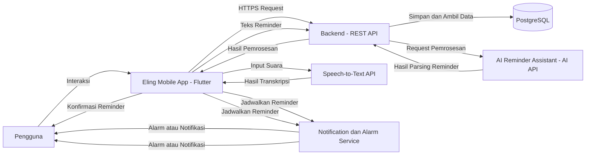

# Deskripsi Perancangan Perangkat Lunak (DPPL)

**Eling – Aplikasi Mobile Pengingat Harian Berbasis AI**

---

# Daftar Isi

1. [Pendahuluan](#1-pendahuluan)
   - [1.1 Tujuan Dokumen](#11-tujuan-dokumen)
   - [1.2 Ruang Lingkup Perancangan](#12-ruang-lingkup-perancangan)
   - [1.3 Referensi](#13-referensi)

2. [Deskripsi Arsitektur Sistem](#2-deskripsi-arsitektur-sistem)
   - [2.1 Gambaran Umum Arsitektur](#21-gambaran-umum-arsitektur)
   - [2.2 Arsitektur Sistem](#22-arsitektur-sistem)
   - [2.3 Komponen Sistem](#23-komponen-sistem)
   - [2.4 Alur Data Sistem](#24-alur-data-sistem)

3. [Perancangan Modul Sistem](#3-perancangan-modul-sistem)
   - [3.1 Modul Autentikasi](#31-modul-autentikasi)
   - [3.2 Modul Manajemen Reminder](#32-modul-manajemen-reminder)
   - [3.3 Modul Alarm dan Notifikasi](#33-modul-alarm-dan-notifikasi)
   - [3.4 Modul Speech-to-Text](#34-modul-speech-to-text)
   - [3.5 Modul AI Reminder Assistant](#35-modul-ai-reminder-assistant)
   - [3.6 Modul Kategori](#36-modul-kategori)
   - [3.7 Modul Riwayat Reminder](#37-modul-riwayat-reminder)
   - [3.8 Modul Pencarian](#38-modul-pencarian)
   - [3.9 Modul Pengaturan](#39-modul-pengaturan)

4. [Perancangan Basis Data](#4-perancangan-basis-data)
   - [4.1 Gambaran Basis Data](#41-gambaran-basis-data)
   - [4.2 Entitas Basis Data](#42-entitas-basis-data)
   - [4.3 Relasi Antarentitas](#43-relasi-antarentitas)
   - [4.4 Struktur Tabel](#44-struktur-tabel)

5. [Perancangan Antarmuka](#5-perancangan-antarmuka)
   - [5.1 Prinsip Perancangan Antarmuka](#51-prinsip-perancangan-antarmuka)
   - [5.2 Halaman Login](#52-halaman-login)
   - [5.3 Halaman Registrasi](#53-halaman-registrasi)
   - [5.4 Halaman Utama](#54-halaman-utama)
   - [5.5 Halaman Tambah Reminder](#55-halaman-tambah-reminder)
   - [5.6 Halaman Input Suara](#56-halaman-input-suara)
   - [5.7 Halaman Preview AI](#57-halaman-preview-ai)
   - [5.8 Halaman Detail Reminder](#58-halaman-detail-reminder)
   - [5.9 Halaman Riwayat](#59-halaman-riwayat)
   - [5.10 Halaman Pengaturan](#510-halaman-pengaturan)

6. [Perancangan Proses Sistem](#6-perancangan-proses-sistem)
   - [6.1 Proses Login](#61-proses-login)
   - [6.2 Proses Membuat Reminder Manual](#62-proses-membuat-reminder-manual)
   - [6.3 Proses Membuat Reminder dengan Suara](#63-proses-membuat-reminder-dengan-suara)
   - [6.4 Proses Pemrosesan AI](#64-proses-pemrosesan-ai)
   - [6.5 Proses Konfirmasi Reminder](#65-proses-konfirmasi-reminder)
   - [6.6 Proses Alarm dan Notifikasi](#66-proses-alarm-dan-notifikasi)
   - [6.7 Proses Snooze](#67-proses-snooze)
   - [6.8 Proses Menyelesaikan Reminder](#68-proses-menyelesaikan-reminder)

7. [Perancangan Integrasi AI](#7-perancangan-integrasi-ai)
   - [7.1 Tujuan Integrasi AI](#71-tujuan-integrasi-ai)
   - [7.2 Input AI](#72-input-ai)
   - [7.3 Output AI](#73-output-ai)
   - [7.4 Format Data AI](#74-format-data-ai)
   - [7.5 Alur Integrasi AI](#75-alur-integrasi-ai)
   - [7.6 Penanganan Kesalahan AI](#76-penanganan-kesalahan-ai)

8. [Perancangan Speech-to-Text](#8-perancangan-speech-to-text)

9. [Perancangan API](#9-perancangan-api)

10. [Perancangan Keamanan](#10-perancangan-keamanan)

11. [Perancangan Deployment](#11-perancangan-deployment)

12. [Pemetaan SKPL terhadap Perancangan](#12-pemetaan-skpl-terhadap-perancangan)

---

# 1. Pendahuluan

## 1.1 Tujuan Dokumen

Dokumen Deskripsi Perancangan Perangkat Lunak (DPPL) ini menjelaskan rancangan teknis dari **Eling**, yaitu aplikasi mobile pengingat aktivitas harian berbasis AI.

Dokumen ini digunakan sebagai acuan dalam proses implementasi perangkat lunak berdasarkan kebutuhan yang telah didefinisikan pada dokumen SKPL.

DPPL menjelaskan rancangan:

- arsitektur sistem;
- modul perangkat lunak;
- basis data;
- antarmuka pengguna;
- proses sistem;
- integrasi AI;
- Speech-to-Text;
- API;
- keamanan;
- deployment.

## 1.2 Ruang Lingkup Perancangan

Perancangan Eling mencakup fitur:

- autentikasi pengguna;
- pengelolaan profil;
- pembuatan reminder;
- pengubahan reminder;
- penghapusan reminder;
- reminder berulang;
- alarm dan notifikasi;
- snooze;
- penyelesaian reminder;
- Speech-to-Text;
- AI Reminder Assistant;
- preview hasil AI;
- konfirmasi hasil AI;
- kategori reminder;
- riwayat reminder;
- pencarian reminder;
- pengaturan notifikasi.

AI digunakan sebagai fitur pendukung untuk membantu pengguna membuat reminder dari input bahasa natural.

Sistem tidak merancang fitur:

- analisis pola kebiasaan;
- insight produktivitas;
- prediksi kebiasaan;
- rekomendasi aktivitas otomatis.

## 1.3 Referensi

Dokumen utama yang digunakan sebagai dasar perancangan adalah:

1. Spesifikasi Kebutuhan Perangkat Lunak (SKPL) Eling.
2. Kebutuhan fungsional dan nonfungsional yang telah didefinisikan pada SKPL.
3. Rancangan penggunaan Flutter sebagai framework aplikasi mobile.
4. Rancangan penggunaan PostgreSQL sebagai basis data.
5. Rancangan penggunaan layanan AI melalui API.

---

# 2. Deskripsi Arsitektur Sistem

## 2.1 Gambaran Umum Arsitektur

Eling menggunakan arsitektur aplikasi yang terdiri dari tiga bagian utama:

1. **Mobile Application**
2. **Backend/API**
3. **External Services**

Mobile Application digunakan oleh pengguna untuk melakukan interaksi dengan sistem.

Backend/API digunakan untuk mengelola autentikasi, data reminder, kategori, riwayat, serta komunikasi dengan layanan eksternal.

External Services digunakan untuk layanan yang membutuhkan pemrosesan khusus, yaitu:

- layanan AI;
- layanan Speech-to-Text.

Gambaran umum arsitektur:

