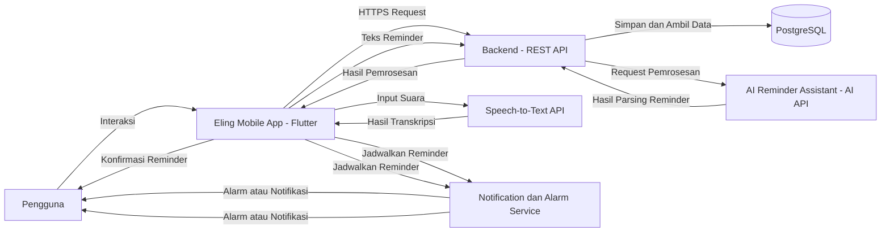
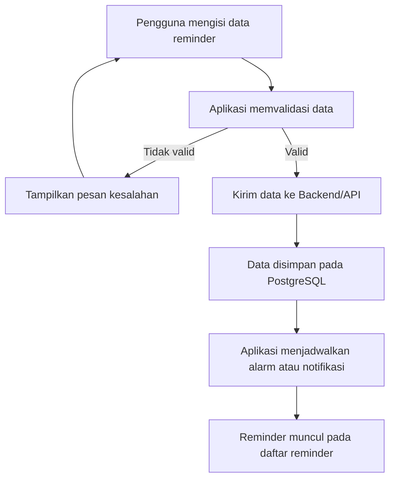
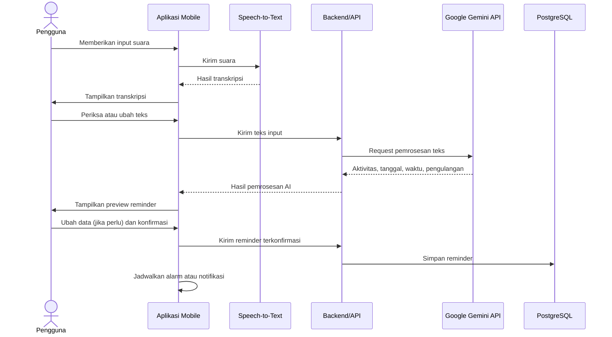

# Deskripsi Perancangan Perangkat Lunak (DPPL)

**Eling – Aplikasi Mobile Pengingat Harian Berbasis AI**

---

# Daftar Isi

1. [Pendahuluan](#1-pendahuluan)
   - [1.1 Tujuan Dokumen](#11-tujuan-dokumen)
   - [1.2 Ruang Lingkup Perancangan](#12-ruang-lingkup-perancangan)
   - [1.3 Referensi](#13-referensi)

2. [Deskripsi Arsitektur Sistem](#2-deskripsi-arsitektur-sistem)
   - [2.1 Gambaran Umum Arsitektur](#21-gambaran-umum-arsitektur)
   - [2.2 Arsitektur Sistem](#22-arsitektur-sistem)
   - [2.3 Komponen Sistem](#23-komponen-sistem)
   - [2.4 Alur Data Sistem](#24-alur-data-sistem)

3. [Perancangan Modul Sistem](#3-perancangan-modul-sistem)
   - [3.1 Modul Autentikasi](#31-modul-autentikasi)
   - [3.2 Modul Manajemen Reminder](#32-modul-manajemen-reminder)
   - [3.3 Modul Alarm dan Notifikasi](#33-modul-alarm-dan-notifikasi)
   - [3.4 Modul Speech-to-Text](#34-modul-speech-to-text)
   - [3.5 Modul AI Reminder Assistant](#35-modul-ai-reminder-assistant)
   - [3.6 Modul Kategori](#36-modul-kategori)
   - [3.7 Modul Riwayat Reminder](#37-modul-riwayat-reminder)
   - [3.8 Modul Pencarian](#38-modul-pencarian)
   - [3.9 Modul Pengaturan](#39-modul-pengaturan)

4. [Perancangan Basis Data](#4-perancangan-basis-data)
   - [4.1 Gambaran Basis Data](#41-gambaran-basis-data)
   - [4.2 Entitas Basis Data](#42-entitas-basis-data)
   - [4.3 Relasi Antarentitas](#43-relasi-antarentitas)
   - [4.4 Struktur Tabel](#44-struktur-tabel)

5. [Perancangan Antarmuka](#5-perancangan-antarmuka)
   - [5.1 Prinsip Perancangan Antarmuka](#51-prinsip-perancangan-antarmuka)
   - [5.2 Halaman Login](#52-halaman-login)
   - [5.3 Halaman Registrasi](#53-halaman-registrasi)
   - [5.4 Halaman Utama](#54-halaman-utama)
   - [5.5 Halaman Tambah Reminder](#55-halaman-tambah-reminder)
   - [5.6 Halaman Input Suara](#56-halaman-input-suara)
   - [5.7 Halaman Preview AI](#57-halaman-preview-ai)
   - [5.8 Halaman Detail Reminder](#58-halaman-detail-reminder)
   - [5.9 Halaman Riwayat](#59-halaman-riwayat)
   - [5.10 Halaman Pengaturan](#510-halaman-pengaturan)

6. [Perancangan Proses Sistem](#6-perancangan-proses-sistem)
   - [6.1 Proses Login](#61-proses-login)
   - [6.2 Proses Membuat Reminder Manual](#62-proses-membuat-reminder-manual)
   - [6.3 Proses Membuat Reminder dengan Suara](#63-proses-membuat-reminder-dengan-suara)
   - [6.4 Proses Pemrosesan AI](#64-proses-pemrosesan-ai)
   - [6.5 Proses Konfirmasi Reminder](#65-proses-konfirmasi-reminder)
   - [6.6 Proses Alarm dan Notifikasi](#66-proses-alarm-dan-notifikasi)
   - [6.7 Proses Snooze](#67-proses-snooze)
   - [6.8 Proses Menyelesaikan Reminder](#68-proses-menyelesaikan-reminder)

7. [Perancangan Integrasi AI](#7-perancangan-integrasi-ai)
   - [7.1 Tujuan Integrasi AI](#71-tujuan-integrasi-ai)
   - [7.2 Input AI](#72-input-ai)
   - [7.3 Output AI](#73-output-ai)
   - [7.4 Format Data AI](#74-format-data-ai)
   - [7.5 Alur Integrasi AI](#75-alur-integrasi-ai)
   - [7.6 Penanganan Kesalahan AI](#76-penanganan-kesalahan-ai)

8. [Perancangan Speech-to-Text](#8-perancangan-speech-to-text)

9. [Perancangan API](#9-perancangan-api)

10. [Perancangan Keamanan](#10-perancangan-keamanan)

11. [Perancangan Deployment](#11-perancangan-deployment)

12. [Pemetaan SKPL terhadap Perancangan](#12-pemetaan-skpl-terhadap-perancangan)

---

# 1. Pendahuluan

## 1.1 Tujuan Dokumen

Dokumen Deskripsi Perancangan Perangkat Lunak (DPPL) ini menjelaskan rancangan teknis dari **Eling**, yaitu aplikasi mobile pengingat aktivitas harian berbasis AI.

Dokumen ini digunakan sebagai acuan dalam proses implementasi perangkat lunak berdasarkan kebutuhan yang telah didefinisikan pada dokumen SKPL.

DPPL menjelaskan rancangan:

- arsitektur sistem;
- modul perangkat lunak;
- basis data;
- antarmuka pengguna;
- proses sistem;
- integrasi AI;
- Speech-to-Text;
- API;
- keamanan;
- deployment.

## 1.2 Ruang Lingkup Perancangan

Perancangan Eling mencakup fitur:

- autentikasi pengguna;
- pengelolaan profil;
- pembuatan reminder;
- pengubahan reminder;
- penghapusan reminder;
- reminder berulang;
- alarm dan notifikasi;
- snooze;
- penyelesaian reminder;
- Speech-to-Text;
- AI Reminder Assistant;
- preview hasil AI;
- konfirmasi hasil AI;
- kategori reminder;
- riwayat reminder;
- pencarian reminder;
- pengaturan notifikasi.

AI digunakan sebagai fitur pendukung untuk membantu pengguna membuat reminder dari input bahasa natural.

Sistem tidak merancang fitur:

- analisis pola kebiasaan;
- insight produktivitas;
- prediksi kebiasaan;
- rekomendasi aktivitas otomatis.

## 1.3 Referensi

Dokumen utama yang digunakan sebagai dasar perancangan adalah:

1. Spesifikasi Kebutuhan Perangkat Lunak (SKPL) Eling.
2. Kebutuhan fungsional dan nonfungsional yang telah didefinisikan pada SKPL.
3. Rancangan penggunaan Flutter sebagai framework aplikasi mobile.
4. Rancangan penggunaan PostgreSQL sebagai basis data.
5. Rancangan penggunaan layanan AI melalui API.

---

# 2. Deskripsi Arsitektur Sistem

## 2.1 Gambaran Umum Arsitektur

Eling menggunakan arsitektur aplikasi yang terdiri dari tiga bagian utama:

1. **Mobile Application**
2. **Backend/API**
3. **External Services**

Mobile Application digunakan oleh pengguna untuk melakukan interaksi dengan sistem.

Backend/API digunakan untuk mengelola autentikasi, data reminder, kategori, riwayat, serta komunikasi dengan layanan eksternal.

External Services digunakan untuk layanan yang membutuhkan pemrosesan khusus, yaitu:

- layanan AI;
- layanan Speech-to-Text.

Gambaran umum arsitektur:

## 2.2 Arsitektur Sistem
 
Arsitektur Eling dibagi menjadi beberapa lapisan berdasarkan tanggung jawab masing-masing komponen. Pembagian tersebut bertujuan agar sistem lebih mudah dikembangkan, dipelihara, dan diuji.
 
### 2.2.1 Lapisan Presentasi
 
Lapisan presentasi berada pada aplikasi mobile Flutter dan bertanggung jawab terhadap interaksi langsung dengan pengguna. Fungsi utama lapisan ini meliputi:
 
- menampilkan halaman aplikasi;
- menerima input pengguna;
- menampilkan daftar reminder;
- menampilkan detail reminder;
- menampilkan hasil Speech-to-Text;
- menampilkan preview hasil AI;
- menerima konfirmasi pengguna;
- menampilkan notifikasi dan status reminder;
- menyediakan navigasi antarhalaman.
Lapisan ini tidak bertanggung jawab langsung terhadap penyimpanan permanen data. Data yang membutuhkan penyimpanan akan diteruskan melalui mekanisme komunikasi dengan backend/API.
 
### 2.2.2 Lapisan Aplikasi
 
Lapisan aplikasi menangani logika utama yang berkaitan dengan proses reminder. Fungsi lapisan aplikasi meliputi:
 
- validasi data reminder;
- pembuatan reminder;
- perubahan reminder;
- penghapusan reminder;
- pengaturan reminder berulang;
- pengelolaan status reminder;
- pengelolaan kategori;
- pengelolaan riwayat;
- pencarian reminder;
- pengelolaan proses konfirmasi hasil AI.
Lapisan ini memastikan bahwa data yang akan disimpan telah memenuhi aturan yang ditentukan oleh sistem.
 
### 2.2.3 Lapisan Backend/API
 
Lapisan backend/API berfungsi sebagai penghubung antara aplikasi mobile dengan layanan backend dan layanan eksternal. Pada Eling, backend menggunakan **Supabase** untuk menyediakan layanan:
 
- autentikasi pengguna;
- akses data melalui API;
- pengelolaan basis data;
- pengelolaan akses terhadap data pengguna.
Backend juga menjadi bagian dari jalur komunikasi pemrosesan AI. Input reminder yang telah diberikan oleh pengguna dapat diteruskan ke layanan Google Gemini API melalui backend/API. Dengan pendekatan tersebut, kredensial layanan AI tidak ditempatkan secara langsung pada aplikasi mobile.
 
### 2.2.4 Lapisan Data
 
Lapisan data menggunakan **PostgreSQL melalui Supabase**.Lapisan ini digunakan untuk menyimpan data secara permanen, antara lain:
 
- data pengguna;
- data reminder;
- data kategori;
- data riwayat reminder;
- data pengaturan pengguna;
- data lain yang diperlukan untuk mendukung fungsi aplikasi.
Data reminder dikaitkan dengan pengguna sehingga sistem dapat membatasi akses berdasarkan akun yang sedang digunakan.
 
### 2.2.5 Lapisan Layanan Eksternal
 
Lapisan layanan eksternal terdiri dari layanan yang tidak dijalankan secara langsung oleh aplikasi Eling. Layanan tersebut meliputi:
 
1. **Google Gemini API**, digunakan untuk membantu memahami input reminder dalam bahasa natural.
2. **Speech-to-Text Service**, digunakan untuk mengubah suara pengguna menjadi teks.
Penggunaan layanan eksternal dilakukan hanya ketika fitur yang bersangkutan digunakan oleh pengguna.
 
### 2.2.6 Lapisan Perangkat
 
Beberapa fungsi Eling memanfaatkan kemampuan perangkat mobile, yaitu:
 
- mikrofon untuk input suara;
- layar sentuh untuk interaksi;
- sistem notifikasi perangkat;
- speaker untuk suara notifikasi atau alarm;
- penyimpanan dan konfigurasi perangkat yang diperlukan oleh mekanisme notifikasi.
Local notification dijalankan pada perangkat pengguna berdasarkan reminder yang telah dikonfirmasi dan dijadwalkan.
 
## 2.3 Komponen Sistem
 
Komponen sistem Eling disusun berdasarkan teknologi yang telah ditetapkan pada rancangan project dan kebutuhan yang didefinisikan pada SKPL.
 
### 2.3.1 Komponen Utama
 
| Komponen | Teknologi | Tanggung Jawab |
| --- | --- | --- |
| Aplikasi Mobile Eling | Flutter, Dart | Menampilkan antarmuka, menerima input pengguna, memvalidasi data reminder, mengelola proses konfirmasi hasil AI, serta menjadwalkan alarm dan notifikasi pada perangkat. |
| Backend/API | Supabase, REST API | Menyediakan akses data melalui API, mengelola hak akses data berdasarkan akun pengguna, dan meneruskan input reminder ke layanan AI. |
| Autentikasi | Supabase Auth | Menangani registrasi, login, logout, dan autentikasi pengguna. |
| Basis Data | PostgreSQL (melalui Supabase) | Menyimpan data pengguna, reminder, kategori, riwayat reminder, dan pengaturan pengguna. |
| AI Reminder Assistant | Google Gemini API | Membantu mengenali aktivitas, tanggal, waktu, dan pengulangan dari teks input bahasa natural. |
| Speech-to-Text | Speech-to-Text API/Service, terintegrasi pada Flutter | Mengubah suara pengguna menjadi teks. |
| Local Notification dan Alarm | Local Notification, terintegrasi pada Flutter | Memberikan alarm atau notifikasi pada waktu reminder, termasuk ketika aplikasi tidak sedang dibuka. |
| Perangkat Android | Mikrofon, speaker, layar sentuh, sistem notifikasi | Menyediakan perangkat keras yang dibutuhkan untuk input suara, suara alarm, interaksi, dan penampilan notifikasi. |
 
### 2.3.2 Komponen Internal Aplikasi
 
Fungsi aplikasi dibagi ke dalam modul-modul berikut. Perancangan setiap modul dijelaskan pada Bab 3.
 
| Modul | Fungsi Utama | Fitur Terkait |
| --- | --- | --- |
| Modul Autentikasi | Registrasi, login, logout, dan pengelolaan profil pengguna. | Autentikasi dan manajemen pengguna |
| Modul Manajemen Reminder | Membuat, melihat, mengubah, menghapus reminder, serta mengatur pengulangan. | Manajemen reminder, reminder berulang |
| Modul Alarm dan Notifikasi | Menjadwalkan notifikasi, melakukan snooze, dan menandai reminder selesai. | Alarm dan notifikasi |
| Modul Speech-to-Text | Menerima input suara dan menampilkan hasil transkripsi. | Speech-to-Text |
| Modul AI Reminder Assistant | Mengirim teks input, menerima hasil pemrosesan AI, menampilkan preview, dan meminta konfirmasi. | AI Reminder Assistant, AI Reminder Preview |
| Modul Kategori | Mengelompokkan reminder berdasarkan kategori. | Kategori reminder |
| Modul Riwayat Reminder | Menampilkan reminder yang selesai atau terlewat. | Riwayat reminder |
| Modul Pencarian | Mencari reminder berdasarkan kata kunci dan kategori. | Pencarian reminder |
| Modul Pengaturan | Mengatur status notifikasi, suara, getaran, dan durasi snooze. | Pengaturan reminder dan notifikasi |
 
### 2.3.3 Hubungan Antarkomponen
 
- Aplikasi mobile berkomunikasi dengan backend/API melalui HTTPS.
- Aplikasi mobile berkomunikasi dengan layanan Speech-to-Text untuk mengubah suara menjadi teks.
- Backend/API berkomunikasi dengan Google Gemini API untuk memproses teks input reminder, sehingga kredensial layanan AI tidak disimpan pada aplikasi mobile.
- Backend/API menyimpan dan mengambil data pada PostgreSQL.
- Aplikasi mobile menjadwalkan alarm dan notifikasi melalui mekanisme local notification pada perangkat.
## 2.4 Alur Data Sistem
 
Bagian ini menjelaskan alur data pada fungsi-fungsi utama Eling. Penjelasan langkah proses yang lebih rinci dibahas pada Bab 6.
 
### 2.4.1 Alur Autentikasi
 
1. Pengguna memasukkan data registrasi atau login pada aplikasi mobile.
2. Aplikasi mengirim data tersebut ke layanan autentikasi pada backend.
3. Backend memverifikasi data dan mengembalikan hasil autentikasi.
4. Apabila berhasil, pengguna dapat mengakses data reminder miliknya sendiri. Apabila gagal, aplikasi menampilkan pesan kesalahan.
### 2.4.2 Alur Pembuatan Reminder Manual
 

 
### 2.4.3 Alur Pembuatan Reminder dengan Suara dan AI
 

 
Ketentuan pada alur ini:
 
- hasil pemrosesan AI hanya ditampilkan sebagai preview dan belum menjadi reminder aktif;
- reminder baru disimpan setelah pengguna memberikan konfirmasi;
- teks hasil Speech-to-Text dapat diubah pengguna sebelum dikirim ke AI;
- data yang dikirim ke layanan AI dibatasi pada teks input yang diperlukan untuk pemrosesan reminder;
- apabila Speech-to-Text atau layanan AI gagal, aplikasi menampilkan pesan kesalahan dan pengguna tetap dapat membuat reminder secara manual.
### 2.4.4 Alur Alarm dan Notifikasi
 
1. Setelah reminder disimpan, aplikasi menjadwalkan alarm atau notifikasi lokal sesuai tanggal, waktu, dan pengulangan reminder.
2. Ketika waktu reminder tiba, perangkat menampilkan notifikasi yang memuat aktivitas reminder, sesuai pengaturan suara dan getaran pengguna.
3. Pengguna dapat memilih salah satu tindakan:
   - **Snooze**: alarm dijadwalkan kembali sesuai durasi snooze;
   - **Selesai**: status reminder diperbarui menjadi selesai dan dicatat pada riwayat.
4. Reminder yang tidak diselesaikan dicatat dengan status terlewat pada riwayat.
Penjadwalan notifikasi dijalankan pada perangkat sehingga reminder tetap dapat memberikan notifikasi tanpa aplikasi dibuka secara terus-menerus, selama izin notifikasi diberikan pengguna.
 
### 2.4.5 Alur Data Pengelolaan Reminder
 
| Proses | Data Masuk | Data Keluar |
| --- | --- | --- |
| Melihat daftar dan detail reminder | Permintaan pengguna | Data reminder milik pengguna yang sedang login |
| Mengubah reminder | Data reminder yang diperbarui | Data reminder tersimpan dan jadwal notifikasi diperbarui |
| Menghapus reminder | Permintaan hapus | Reminder terhapus dan jadwal notifikasi dibatalkan |
| Mencari reminder | Kata kunci atau kategori | Daftar reminder yang sesuai |
| Melihat riwayat | Permintaan pengguna | Daftar reminder berstatus selesai atau terlewat |
| Mengubah pengaturan | Status notifikasi, suara, getaran, durasi snooze | Pengaturan tersimpan dan digunakan pada penjadwalan berikutnya |
 
Seluruh akses data pada proses di atas dibatasi berdasarkan akun pengguna yang sedang login.
 
---
